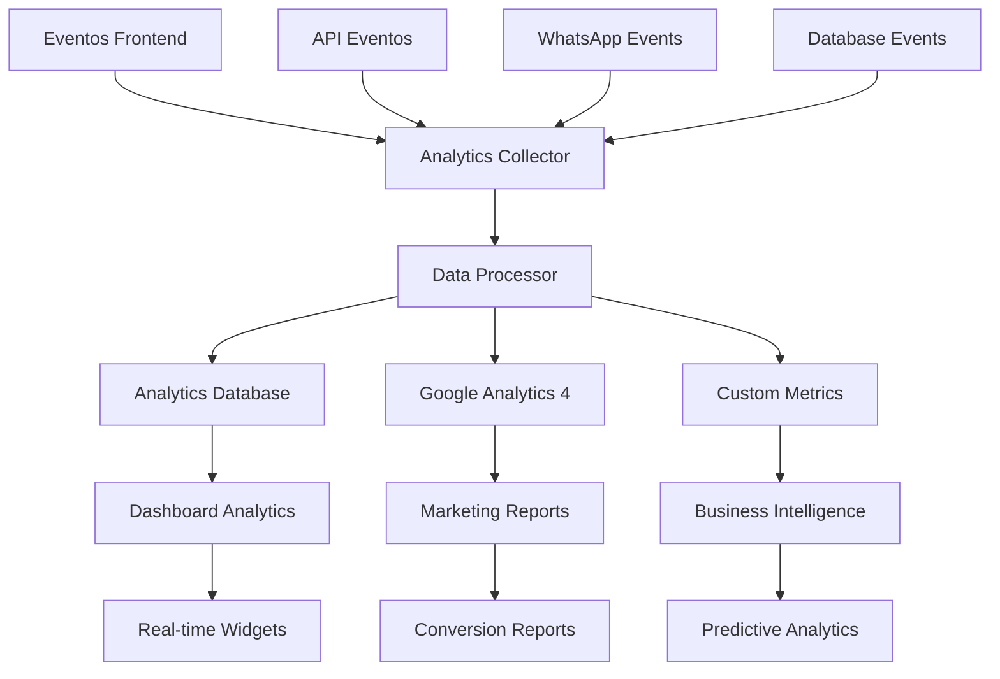

# 📊 Analytics & Métricas - CRM Pro Dashboard

## 📋 Índice

- [Visão Geral](#visão-geral)
- [Métricas Principais](#métricas-principais)
- [Google Analytics 4](#google-analytics-4)
- [Analytics Personalizados](#analytics-personalizados)
- [Dashboards](#dashboards)
- [Relatórios](#relatórios)
- [Métricas de Performance](#métricas-de-performance)
- [Analytics de Conversão](#analytics-de-conversão)
- [Análise de Comportamento](#análise-de-comportamento)
- [Métricas de WhatsApp](#métricas-de-whatsapp)
- [Business Intelligence](#business-intelligence)
- [Exportação de Dados](#exportação-de-dados)
- [Configuração](#configuração)
- [Troubleshooting](#troubleshooting)

---

## 🎯 Visão Geral

O sistema de analytics do CRM Pro Dashboard fornece insights abrangentes sobre performance, conversões, comportamento do usuário e ROI das campanhas de marketing.

### Arquitetura de Analytics



---

## 📈 Métricas Principais

### KPIs Essenciais

| Métrica | Descrição | Objetivo | Fonte |
|---------|-----------|----------|--------|
| **CAC** | Custo de Aquisição de Cliente | < R$ 100 | GA4 + CRM |
| **LTV** | Lifetime Value | > R$ 1000 | Database |
| **Taxa de Conversão** | Leads → Clientes | > 15% | CRM + Analytics |
| **Tempo de Resposta** | Tempo médio de resposta | < 5 min | WhatsApp API |
| **NPS** | Net Promoter Score | > 70 | Surveys |
| **Churn Rate** | Taxa de cancelamento | < 5% | Database |
| **ROI** | Return on Investment | > 300% | Financial + Analytics |

### Métricas em Tempo Real

```javascript
// Sistema de métricas em tempo real
class RealTimeMetrics {
  static async getCurrentMetrics() {
    const [
      activeUsers,
      messagesInQueue,
      responseTime,
      conversionsToday,
      systemHealth
    ] = await Promise.all([
      this.getActiveUsers(),
      this.getMessageQueue(),
      this.getAverageResponseTime(),
      this.getTodayConversions(),
      this.getSystemHealth()
    ]);
    
    return {
      timestamp: new Date().toISOString(),
      metrics: {
        activeUsers,
        messagesInQueue,
        responseTime,
        conversionsToday,
        systemHealth
      }
    };
  }
  
  static async getActiveUsers() {
    const result = await db.query(`
      SELECT COUNT(DISTINCT user_id) as active_users
      FROM user_sessions 
      WHERE last_activity > NOW() - INTERVAL '15 minutes'
    `);
    return result.rows[0].active_users;
  }
  
  static async getMessageQueue() {
    const result = await db.query(`
      SELECT COUNT(*) as pending_messages
      FROM message_queue 
      WHERE status = 'pending'
    `);
    return result.rows[0].pending_messages;
  }
  
  static async getAverageResponseTime() {
    const result = await db.query(`
      SELECT 
        AVG(EXTRACT(EPOCH FROM (responded_at - received_at))) as avg_response_time
      FROM messages 
      WHERE responded_at IS NOT NULL 
      AND received_at > NOW() - INTERVAL '24 hours'
    `);
    return Math.round(result.rows[0].avg_response_time || 0);
  }
}
```

---

## 📊 Google Analytics 4

### Configuração GA4

```javascript
// Configuração do Google Analytics 4
import { GoogleAnalytics } from '@next/third-parties/google';

// Eventos personalizados
export const trackEvent = (eventName, parameters = {}) => {
  if (typeof window !== 'undefined' && window.gtag) {
    window.gtag('event', eventName, {
      event_category: parameters.category || 'engagement',
      event_label: parameters.label,
      value: parameters.value,
      custom_parameter_1: parameters.custom1,
      custom_parameter_2: parameters.custom2,
      ...parameters
    });
  }
};

// Eventos de e-commerce
export const trackPurchase = (transactionData) => {
  trackEvent('purchase', {
    transaction_id: transactionData.id,
    value: transactionData.value,
    currency: 'BRL',
    items: transactionData.items
  });
};

// Eventos de conversão
export const trackConversion = (conversionType, value) => {
  trackEvent('conversion', {
    conversion_type: conversionType,
    value: value,
    currency: 'BRL'
  });
};

// Hook para tracking automático
export const useAnalytics = () => {
  const trackPageView = (path) => {
    if (typeof window !== 'undefined' && window.gtag) {
      window.gtag('config', process.env.NEXT_PUBLIC_GA_ID, {
        page_path: path,
      });
    }
  };
  
  const trackUserAction = (action, data = {}) => {
    trackEvent('user_action', {
      action_type: action,
      timestamp: new Date().toISOString(),
      ...data
    });
  };
  
  return { trackPageView, trackUserAction, trackEvent };
};
```

### Enhanced E-commerce

```javascript
// E-commerce tracking avançado
class EcommerceTracking {
  static trackViewItem(item) {
    gtag('event', 'view_item', {
      currency: 'BRL',
      value: item.price,
      items: [{
        item_id: item.id,
        item_name: item.name,
        item_category: item.category,
        price: item.price,
        quantity: 1
      }]
    });
  }
  
  static trackAddToCart(item) {
    gtag('event', 'add_to_cart', {
      currency: 'BRL',
      value: item.price,
      items: [item]
    });
  }
  
  static trackBeginCheckout(items, value) {
    gtag('event', 'begin_checkout', {
      currency: 'BRL',
      value: value,
      items: items
    });
  }
  
  static trackPurchase(transactionData) {
    gtag('event', 'purchase', {
      transaction_id: transactionData.id,
      value: transactionData.total,
      currency: 'BRL',
      items: transactionData.items,
      shipping: transactionData.shipping,
      tax: transactionData.tax
    });
  }
}
```

---

## 🔧 Analytics Personalizados

### Sistema de Eventos Personalizados

```javascript
// Analytics Engine personalizado
class CustomAnalytics {
  static async trackCustomEvent(userId, eventType, eventData) {
    const event = {
      user_id: userId,
      event_type: eventType,
      event_data: eventData,
      timestamp: new Date(),
      session_id: this.getSessionId(),
      ip_address: this.getClientIP(),
      user_agent: this.getUserAgent()
    };
    
    // Salvar no banco de dados
    await db.query(`
      INSERT INTO custom_events (
        user_id, event_type, event_data, timestamp, 
        session_id, ip_address, user_agent
      ) VALUES ($1, $2, $3, $4, $5, $6, $7)
    `, [
      event.user_id, event.event_type, JSON.stringify(event.event_data),
      event.timestamp, event.session_id, event.ip_address, event.user_agent
    ]);
    
    // Enviar para fila de processamento
    await this.queueForProcessing(event);
    
    // Atualizar métricas em tempo real
    await this.updateRealTimeMetrics(eventType, eventData);
  }
  
  static async generateCustomReport(reportType, filters = {}) {
    const queries = {
      user_engagement: `
        SELECT 
          DATE_TRUNC('day', timestamp) as date,
          COUNT(DISTINCT user_id) as active_users,
          COUNT(*) as total_events,
          AVG(CAST(event_data->>'duration' AS INTEGER)) as avg_session_duration
        FROM custom_events 
        WHERE timestamp BETWEEN $1 AND $2
        GROUP BY DATE_TRUNC('day', timestamp)
        ORDER BY date
      `,
      
      feature_usage: `
        SELECT 
          event_data->>'feature' as feature_name,
          COUNT(*) as usage_count,
          COUNT(DISTINCT user_id) as unique_users
        FROM custom_events 
        WHERE event_type = 'feature_usage'
        AND timestamp BETWEEN $1 AND $2
        GROUP BY event_data->>'feature'
        ORDER BY usage_count DESC
      `,
      
      conversion_funnel: `
        WITH funnel_steps AS (
          SELECT 
            user_id,
            MIN(CASE WHEN event_type = 'page_view' THEN timestamp END) as visited,
            MIN(CASE WHEN event_type = 'form_start' THEN timestamp END) as started_form,
            MIN(CASE WHEN event_type = 'form_submit' THEN timestamp END) as submitted_form,
            MIN(CASE WHEN event_type = 'conversion' THEN timestamp END) as converted
          FROM custom_events
          WHERE timestamp BETWEEN $1 AND $2
          GROUP BY user_id
        )
        SELECT 
          COUNT(*) as total_visitors,
          COUNT(started_form) as form_starters,
          COUNT(submitted_form) as form_submitters,
          COUNT(converted) as converters,
          ROUND(COUNT(started_form)::numeric / COUNT(*) * 100, 2) as visit_to_start_rate,
          ROUND(COUNT(submitted_form)::numeric / COUNT(started_form) * 100, 2) as start_to_submit_rate,
          ROUND(COUNT(converted)::numeric / COUNT(submitted_form) * 100, 2) as submit_to_convert_rate
        FROM funnel_steps
      `
    };
    
    const query = queries[reportType];
    if (!query) throw new Error('Tipo de relatório não encontrado');
    
    const result = await db.query(query, [filters.startDate, filters.endDate]);
    return result.rows;
  }
}
```

### Métricas de Engajamento

```javascript
// Sistema de métricas de engajamento
class EngagementMetrics {
  static async calculateUserEngagement(userId, period = '7d') {
    const endDate = new Date();
    const startDate = new Date(endDate);
    
    switch(period) {
      case '1d': startDate.setDate(startDate.getDate() - 1); break;
      case '7d': startDate.setDate(startDate.getDate() - 7); break;
      case '30d': startDate.setDate(startDate.getDate() - 30); break;
    }
    
    const metrics = await db.query(`
      SELECT 
        COUNT(DISTINCT DATE(timestamp)) as active_days,
        COUNT(*) as total_events,
        COUNT(DISTINCT session_id) as sessions,
        AVG(
          EXTRACT(EPOCH FROM session_end - session_start) / 60
        ) as avg_session_duration,
        COUNT(CASE WHEN event_type = 'feature_usage' THEN 1 END) as feature_interactions
      FROM (
        SELECT 
          user_id, event_type, timestamp, session_id,
          MIN(timestamp) OVER (PARTITION BY session_id) as session_start,
          MAX(timestamp) OVER (PARTITION BY session_id) as session_end
        FROM custom_events 
        WHERE user_id = $1 
        AND timestamp BETWEEN $2 AND $3
      ) t
    `, [userId, startDate, endDate]);
    
    const result = metrics.rows[0];
    
    // Calcular score de engajamento
    const engagementScore = this.calculateEngagementScore({
      activeDays: result.active_days,
      totalEvents: result.total_events,
      sessions: result.sessions,
      avgSessionDuration: result.avg_session_duration,
      featureInteractions: result.feature_interactions
    });
    
    return {
      ...result,
      engagement_score: engagementScore,
      period: period
    };
  }
  
  static calculateEngagementScore(metrics) {
    const weights = {
      activeDays: 0.3,
      sessions: 0.2,
      avgSessionDuration: 0.25,
      featureInteractions: 0.25
    };
    
    // Normalizar métricas (0-100)
    const normalizedMetrics = {
      activeDays: Math.min(metrics.activeDays / 7 * 100, 100),
      sessions: Math.min(metrics.sessions / 10 * 100, 100),
      avgSessionDuration: Math.min(metrics.avgSessionDuration / 30 * 100, 100),
      featureInteractions: Math.min(metrics.featureInteractions / 20 * 100, 100)
    };
    
    // Calcular score ponderado
    let score = 0;
    for (const [metric, value] of Object.entries(normalizedMetrics)) {
      score += value * weights[metric];
    }
    
    return Math.round(score);
  }
}
```

---

## 📊 Dashboards

### Dashboard de Métricas Principais

```tsx
// Componente de Dashboard Analytics
import { useEffect, useState } from 'react';
import { Card, CardContent, CardHeader, CardTitle } from '@/components/ui/card';
import { TrendingUp, Users, MessageCircle, Target } from 'lucide-react';

export function AnalyticsDashboard() {
  const [metrics, setMetrics] = useState(null);
  const [loading, setLoading] = useState(true);
  
  useEffect(() => {
    fetchMetrics();
    const interval = setInterval(fetchMetrics, 30000); // Atualizar a cada 30s
    return () => clearInterval(interval);
  }, []);
  
  const fetchMetrics = async () => {
    try {
      const response = await fetch('/api/analytics/dashboard');
      const data = await response.json();
      setMetrics(data);
    } catch (error) {
      console.error('Erro ao buscar métricas:', error);
    } finally {
      setLoading(false);
    }
  };
  
  if (loading) return <div>Carregando métricas...</div>;
  
  return (
    <div className="grid grid-cols-1 md:grid-cols-2 lg:grid-cols-4 gap-6">
      <Card>
        <CardHeader className="flex flex-row items-center justify-between space-y-0 pb-2">
          <CardTitle className="text-sm font-medium">Usuários Ativos</CardTitle>
          <Users className="h-4 w-4 text-muted-foreground" />
        </CardHeader>
        <CardContent>
          <div className="text-2xl font-bold">{metrics?.activeUsers}</div>
          <p className="text-xs text-muted-foreground">
            +{metrics?.activeUsersGrowth}% em relação ao mês passado
          </p>
        </CardContent>
      </Card>
      
      <Card>
        <CardHeader className="flex flex-row items-center justify-between space-y-0 pb-2">
          <CardTitle className="text-sm font-medium">Mensagens Enviadas</CardTitle>
          <MessageCircle className="h-4 w-4 text-muted-foreground" />
        </CardHeader>
        <CardContent>
          <div className="text-2xl font-bold">{metrics?.messagesSent}</div>
          <p className="text-xs text-muted-foreground">
            {metrics?.messagesGrowth > 0 ? '+' : ''}{metrics?.messagesGrowth}% esta semana
          </p>
        </CardContent>
      </Card>
      
      <Card>
        <CardHeader className="flex flex-row items-center justify-between space-y-0 pb-2">
          <CardTitle className="text-sm font-medium">Taxa de Conversão</CardTitle>
          <Target className="h-4 w-4 text-muted-foreground" />
        </CardHeader>
        <CardContent>
          <div className="text-2xl font-bold">{metrics?.conversionRate}%</div>
          <p className="text-xs text-muted-foreground">
            Meta: {metrics?.conversionTarget}%
          </p>
        </CardContent>
      </Card>
      
      <Card>
        <CardHeader className="flex flex-row items-center justify-between space-y-0 pb-2">
          <CardTitle className="text-sm font-medium">ROI</CardTitle>
          <TrendingUp className="h-4 w-4 text-muted-foreground" />
        </CardHeader>
        <CardContent>
          <div className="text-2xl font-bold">{metrics?.roi}%</div>
          <p className="text-xs text-muted-foreground">
            Return on Investment
          </p>
        </CardContent>
      </Card>
    </div>
  );
}
```

### Gráficos Interativos

```tsx
// Componente de gráficos com Chart.js
import { Line, Bar, Doughnut } from 'react-chartjs-2';
import {
  Chart as ChartJS,
  CategoryScale,
  LinearScale,
  PointElement,
  LineElement,
  BarElement,
  ArcElement,
  Title,
  Tooltip,
  Legend,
} from 'chart.js';

ChartJS.register(
  CategoryScale, LinearScale, PointElement, LineElement,
  BarElement, ArcElement, Title, Tooltip, Legend
);

export function ConversionChart({ data }) {
  const chartData = {
    labels: data.labels,
    datasets: [
      {
        label: 'Conversões',
        data: data.conversions,
        borderColor: 'rgb(75, 192, 192)',
        backgroundColor: 'rgba(75, 192, 192, 0.2)',
        tension: 0.1
      },
      {
        label: 'Leads',
        data: data.leads,
        borderColor: 'rgb(255, 99, 132)',
        backgroundColor: 'rgba(255, 99, 132, 0.2)',
        tension: 0.1
      }
    ]
  };
  
  const options = {
    responsive: true,
    plugins: {
      legend: {
        position: 'top',
      },
      title: {
        display: true,
        text: 'Funil de Conversão - Últimos 30 dias'
      }
    },
    scales: {
      y: {
        beginAtZero: true
      }
    }
  };
  
  return <Line data={chartData} options={options} />;
}

export function EngagementChart({ data }) {
  const chartData = {
    labels: ['Baixo', 'Médio', 'Alto', 'Muito Alto'],
    datasets: [
      {
        data: data.engagementLevels,
        backgroundColor: [
          '#ff6384',
          '#ff9f40',
          '#ffcd56',
          '#4bc0c0'
        ],
        borderWidth: 1
      }
    ]
  };
  
  const options = {
    responsive: true,
    plugins: {
      legend: {
        position: 'bottom',
      },
      title: {
        display: true,
        text: 'Níveis de Engajamento dos Usuários'
      }
    }
  };
  
  return <Doughnut data={chartData} options={options} />;
}
```

---

## 📋 Relatórios

### Relatórios Automatizados

```javascript
// Sistema de relatórios automatizados
class ReportGenerator {
  static async generateDailyReport() {
    const yesterday = new Date();
    yesterday.setDate(yesterday.getDate() - 1);
    
    const data = await this.collectDailyData(yesterday);
    const report = this.formatDailyReport(data);
    
    // Enviar por email
    await this.sendReportByEmail(report, 'daily');
    
    // Salvar no sistema
    await this.saveReport(report, 'daily', yesterday);
    
    return report;
  }
  
  static async generateWeeklyReport() {
    const lastWeekStart = new Date();
    lastWeekStart.setDate(lastWeekStart.getDate() - 7);
    const lastWeekEnd = new Date();
    lastWeekEnd.setDate(lastWeekEnd.getDate() - 1);
    
    const data = await this.collectWeeklyData(lastWeekStart, lastWeekEnd);
    const report = this.formatWeeklyReport(data);
    
    // Gerar insights automatizados
    const insights = await this.generateInsights(data);
    report.insights = insights;
    
    await this.sendReportByEmail(report, 'weekly');
    await this.saveReport(report, 'weekly', lastWeekStart);
    
    return report;
  }
  
  static async collectDailyData(date) {
    const queries = {
      users: `SELECT COUNT(DISTINCT user_id) FROM user_sessions WHERE DATE(created_at) = $1`,
      messages: `SELECT COUNT(*) FROM messages WHERE DATE(created_at) = $1`,
      conversions: `SELECT COUNT(*) FROM conversions WHERE DATE(created_at) = $1`,
      revenue: `SELECT SUM(amount) FROM transactions WHERE DATE(created_at) = $1 AND status = 'completed'`
    };
    
    const results = {};
    for (const [key, query] of Object.entries(queries)) {
      const result = await db.query(query, [date]);
      results[key] = result.rows[0].count || result.rows[0].sum || 0;
    }
    
    return results;
  }
  
  static formatDailyReport(data) {
    return {
      date: new Date().toISOString().split('T')[0],
      metrics: {
        activeUsers: data.users,
        messagesSent: data.messages,
        conversions: data.conversions,
        revenue: data.revenue
      },
      summary: `
        📊 Relatório Diário - ${new Date().toLocaleDateString('pt-BR')}
        
        👥 Usuários Ativos: ${data.users}
        💬 Mensagens Enviadas: ${data.messages}
        🎯 Conversões: ${data.conversions}
        💰 Receita: R$ ${data.revenue?.toFixed(2) || '0.00'}
        
        📈 Performance: ${this.calculateDailyPerformance(data)}
      `
    };
  }
  
  static async generateInsights(data) {
    // IA para gerar insights automáticos
    const insights = [];
    
    // Análise de tendência
    if (data.growth > 10) {
      insights.push({
        type: 'positive',
        message: `Crescimento excepcional de ${data.growth}% esta semana!`,
        action: 'Considere expandir os investimentos em marketing'
      });
    }
    
    // Análise de conversão
    if (data.conversionRate < 10) {
      insights.push({
        type: 'warning',
        message: `Taxa de conversão abaixo do esperado: ${data.conversionRate}%`,
        action: 'Revisar estratégia de follow-up e qualificação de leads'
      });
    }
    
    // Análise de engajamento
    if (data.avgEngagement < 60) {
      insights.push({
        type: 'suggestion',
        message: 'Engajamento dos usuários pode ser melhorado',
        action: 'Implementar gamificação ou conteúdo mais interativo'
      });
    }
    
    return insights;
  }
}
```

### Relatórios Personalizados

```javascript
// Builder de relatórios personalizados
class CustomReportBuilder {
  constructor() {
    this.metrics = [];
    this.filters = {};
    this.groupBy = [];
    this.dateRange = {};
  }
  
  addMetric(metric, aggregation = 'count') {
    this.metrics.push({ metric, aggregation });
    return this;
  }
  
  addFilter(field, operator, value) {
    if (!this.filters[field]) this.filters[field] = [];
    this.filters[field].push({ operator, value });
    return this;
  }
  
  setDateRange(startDate, endDate) {
    this.dateRange = { startDate, endDate };
    return this;
  }
  
  groupByField(field) {
    this.groupBy.push(field);
    return this;
  }
  
  async build() {
    const queryBuilder = new QueryBuilder();
    
    // Construir SELECT
    const selectClauses = this.metrics.map(m => 
      `${m.aggregation.toUpperCase()}(${m.metric}) as ${m.metric}_${m.aggregation}`
    );
    
    if (this.groupBy.length > 0) {
      selectClauses.unshift(...this.groupBy);
    }
    
    queryBuilder.select(selectClauses.join(', '));
    
    // Construir FROM e JOINs
    queryBuilder.from(this.determineBaseTable());
    
    // Construir WHERE
    this.buildWhereClause(queryBuilder);
    
    // Construir GROUP BY
    if (this.groupBy.length > 0) {
      queryBuilder.groupBy(this.groupBy.join(', '));
    }
    
    const query = queryBuilder.build();
    const result = await db.query(query.sql, query.params);
    
    return {
      data: result.rows,
      metadata: {
        metrics: this.metrics,
        filters: this.filters,
        groupBy: this.groupBy,
        dateRange: this.dateRange,
        generatedAt: new Date().toISOString()
      }
    };
  }
}

// Exemplo de uso
const report = await new CustomReportBuilder()
  .addMetric('user_id', 'count')
  .addMetric('revenue', 'sum')
  .addFilter('created_at', '>=', '2024-01-01')
  .addFilter('status', '=', 'active')
  .groupByField('DATE(created_at)')
  .setDateRange('2024-01-01', '2024-01-31')
  .build();
```

---

## ⚡ Métricas de Performance

### Monitoramento de Performance

```javascript
// Sistema de monitoramento de performance
class PerformanceMonitor {
  static async trackPagePerformance(page, metrics) {
    await db.query(`
      INSERT INTO page_performance (
        page, load_time, first_contentful_paint, 
        largest_contentful_paint, cumulative_layout_shift,
        first_input_delay, timestamp
      ) VALUES ($1, $2, $3, $4, $5, $6, NOW())
    `, [
      page,
      metrics.loadTime,
      metrics.firstContentfulPaint,
      metrics.largestContentfulPaint,
      metrics.cumulativeLayoutShift,
      metrics.firstInputDelay
    ]);
  }
  
  static async getPerformanceReport(period = '7d') {
    const result = await db.query(`
      SELECT 
        page,
        AVG(load_time) as avg_load_time,
        AVG(first_contentful_paint) as avg_fcp,
        AVG(largest_contentful_paint) as avg_lcp,
        AVG(cumulative_layout_shift) as avg_cls,
        AVG(first_input_delay) as avg_fid,
        COUNT(*) as measurements
      FROM page_performance 
      WHERE timestamp > NOW() - INTERVAL $1
      GROUP BY page
      ORDER BY avg_load_time DESC
    `, [period]);
    
    return result.rows.map(row => ({
      ...row,
      performance_score: this.calculatePerformanceScore(row)
    }));
  }
  
  static calculatePerformanceScore(metrics) {
    const weights = {
      loadTime: 0.25,
      fcp: 0.25,
      lcp: 0.25,
      cls: 0.15,
      fid: 0.10
    };
    
    // Scores baseados no Core Web Vitals
    const scores = {
      loadTime: this.scoreLoadTime(metrics.avg_load_time),
      fcp: this.scoreFCP(metrics.avg_fcp),
      lcp: this.scoreLCP(metrics.avg_lcp),
      cls: this.scoreCLS(metrics.avg_cls),
      fid: this.scoreFID(metrics.avg_fid)
    };
    
    let totalScore = 0;
    for (const [metric, score] of Object.entries(scores)) {
      totalScore += score * weights[metric];
    }
    
    return Math.round(totalScore);
  }
  
  static scoreLoadTime(time) {
    if (time <= 1000) return 100;
    if (time <= 2500) return 90;
    if (time <= 4000) return 70;
    return 50;
  }
  
  static scoreLCP(lcp) {
    if (lcp <= 2500) return 100;
    if (lcp <= 4000) return 50;
    return 0;
  }
  
  static scoreCLS(cls) {
    if (cls <= 0.1) return 100;
    if (cls <= 0.25) return 50;
    return 0;
  }
}
```

---

## 🎯 Analytics de Conversão

### Funil de Conversão

```javascript
// Sistema de análise de funil de conversão
class ConversionFunnel {
  static async analyzeFunnel(funnelSteps, dateRange) {
    const stepQueries = funnelSteps.map((step, index) => `
      SELECT 
        '${step.name}' as step_name,
        ${index + 1} as step_order,
        COUNT(DISTINCT user_id) as unique_users,
        COUNT(*) as total_events
      FROM custom_events 
      WHERE event_type = '${step.eventType}'
      AND timestamp BETWEEN $1 AND $2
      ${step.filters ? `AND ${step.filters}` : ''}
    `).join(' UNION ALL ');
    
    const funnelData = await db.query(stepQueries, [dateRange.start, dateRange.end]);
    
    // Calcular taxas de conversão entre etapas
    const steps = funnelData.rows.sort((a, b) => a.step_order - b.step_order);
    const conversions = [];
    
    for (let i = 0; i < steps.length; i++) {
      const step = steps[i];
      const previousStep = steps[i - 1];
      
      const conversionRate = previousStep 
        ? (step.unique_users / previousStep.unique_users) * 100
        : 100;
      
      conversions.push({
        ...step,
        conversion_rate: conversionRate,
        drop_off_rate: 100 - conversionRate
      });
    }
    
    return {
      steps: conversions,
      overall_conversion: this.calculateOverallConversion(conversions),
      biggest_drop_off: this.findBiggestDropOff(conversions),
      recommendations: this.generateRecommendations(conversions)
    };
  }
  
  static async trackConversionEvent(userId, eventType, eventData = {}) {
    // Registrar evento de conversão
    await CustomAnalytics.trackCustomEvent(userId, eventType, {
      ...eventData,
      conversion_value: eventData.value || 0,
      conversion_source: eventData.source || 'organic'
    });
    
    // Atualizar métricas de conversão em tempo real
    await this.updateConversionMetrics(eventType, eventData);
    
    // Trigger para automações
    await this.triggerConversionAutomations(userId, eventType, eventData);
  }
  
  static generateRecommendations(conversions) {
    const recommendations = [];
    
    // Encontrar maior queda
    let maxDropOff = 0;
    let dropOffStep = null;
    
    for (let i = 1; i < conversions.length; i++) {
      if (conversions[i].drop_off_rate > maxDropOff) {
        maxDropOff = conversions[i].drop_off_rate;
        dropOffStep = conversions[i];
      }
    }
    
    if (dropOffStep && maxDropOff > 30) {
      recommendations.push({
        type: 'critical',
        step: dropOffStep.step_name,
        issue: `Alta taxa de abandono: ${maxDropOff.toFixed(1)}%`,
        action: 'Revisar UX e simplificar processo nesta etapa'
      });
    }
    
    // Verificar conversão geral
    const overallConversion = conversions[conversions.length - 1]?.conversion_rate || 0;
    if (overallConversion < 10) {
      recommendations.push({
        type: 'warning',
        issue: `Conversão geral baixa: ${overallConversion.toFixed(1)}%`,
        action: 'Implementar estratégias de nurturing e retargeting'
      });
    }
    
    return recommendations;
  }
}
```

---

## 👥 Análise de Comportamento

### User Journey Mapping

```javascript
// Sistema de mapeamento de jornada do usuário
class UserJourneyAnalyzer {
  static async mapUserJourney(userId, timeRange = '30d') {
    const events = await db.query(`
      SELECT 
        event_type,
        event_data,
        timestamp,
        session_id
      FROM custom_events 
      WHERE user_id = $1 
      AND timestamp > NOW() - INTERVAL $2
      ORDER BY timestamp ASC
    `, [userId, timeRange]);
    
    const journey = this.buildJourneyPath(events.rows);
    const patterns = this.identifyPatterns(journey);
    const insights = this.generateJourneyInsights(journey, patterns);
    
    return {
      userId,
      timeRange,
      journey,
      patterns,
      insights,
      summary: this.generateJourneySummary(journey)
    };
  }
  
  static buildJourneyPath(events) {
    const sessions = {};
    
    // Agrupar eventos por sessão
    events.forEach(event => {
      if (!sessions[event.session_id]) {
        sessions[event.session_id] = [];
      }
      sessions[event.session_id].push(event);
    });
    
    // Construir caminho da jornada
    const journeyPath = [];
    Object.values(sessions).forEach(sessionEvents => {
      const sessionPath = {
        session_id: sessionEvents[0].session_id,
        start_time: sessionEvents[0].timestamp,
        end_time: sessionEvents[sessionEvents.length - 1].timestamp,
        duration: this.calculateSessionDuration(sessionEvents),
        events: sessionEvents.map(e => ({
          type: e.event_type,
          timestamp: e.timestamp,
          data: e.event_data
        })),
        path: sessionEvents.map(e => e.event_type).join(' → ')
      };
      journeyPath.push(sessionPath);
    });
    
    return journeyPath;
  }
  
  static identifyPatterns(journey) {
    const patterns = {
      common_paths: {},
      conversion_paths: [],
      drop_off_points: [],
      engagement_patterns: []
    };
    
    // Identificar caminhos comuns
    journey.forEach(session => {
      const path = session.path;
      patterns.common_paths[path] = (patterns.common_paths[path] || 0) + 1;
    });
    
    // Encontrar padrões de conversão
    journey.forEach(session => {
      if (session.events.some(e => e.type === 'conversion')) {
        patterns.conversion_paths.push(session.path);
      }
    });
    
    // Identificar pontos de abandono
    const allEvents = journey.flatMap(s => s.events);
    const eventCounts = {};
    allEvents.forEach(event => {
      eventCounts[event.type] = (eventCounts[event.type] || 0) + 1;
    });
    
    return patterns;
  }
  
  static async analyzeCohortBehavior(cohortDefinition, timeRange) {
    // Análise de coorte baseada em comportamento
    const cohorts = await db.query(`
      SELECT 
        DATE_TRUNC('week', first_seen) as cohort_week,
        COUNT(DISTINCT user_id) as cohort_size
      FROM (
        SELECT 
          user_id,
          MIN(timestamp) as first_seen
        FROM custom_events
        WHERE timestamp > NOW() - INTERVAL $1
        GROUP BY user_id
      ) first_events
      GROUP BY DATE_TRUNC('week', first_seen)
      ORDER BY cohort_week
    `, [timeRange]);
    
    // Calcular retenção por coorte
    const retentionData = {};
    for (const cohort of cohorts.rows) {
      const retention = await this.calculateCohortRetention(cohort.cohort_week);
      retentionData[cohort.cohort_week] = retention;
    }
    
    return {
      cohorts: cohorts.rows,
      retention: retentionData,
      insights: this.generateCohortInsights(retentionData)
    };
  }
}
```

---

## 📱 Métricas de WhatsApp

### Analytics do WhatsApp

```javascript
// Sistema de analytics específico para WhatsApp
class WhatsAppAnalytics {
  static async getMessageMetrics(dateRange) {
    const metrics = await db.query(`
      SELECT 
        COUNT(*) as total_messages,
        COUNT(CASE WHEN direction = 'out' THEN 1 END) as sent_messages,
        COUNT(CASE WHEN direction = 'in' THEN 1 END) as received_messages,
        COUNT(CASE WHEN status = 'delivered' THEN 1 END) as delivered_messages,
        COUNT(CASE WHEN status = 'read' THEN 1 END) as read_messages,
        COUNT(CASE WHEN type = 'text' THEN 1 END) as text_messages,
        COUNT(CASE WHEN type = 'image' THEN 1 END) as image_messages,
        COUNT(CASE WHEN type = 'document' THEN 1 END) as document_messages,
        AVG(EXTRACT(EPOCH FROM responded_at - created_at)) as avg_response_time
      FROM messages 
      WHERE created_at BETWEEN $1 AND $2
    `, [dateRange.start, dateRange.end]);
    
    const result = metrics.rows[0];
    
    return {
      ...result,
      delivery_rate: (result.delivered_messages / result.sent_messages * 100).toFixed(2),
      read_rate: (result.read_messages / result.delivered_messages * 100).toFixed(2),
      response_rate: ((result.received_messages / result.sent_messages) * 100).toFixed(2)
    };
  }
  
  static async getConversationMetrics(dateRange) {
    const conversations = await db.query(`
      SELECT 
        contact_id,
        COUNT(*) as message_count,
        MIN(created_at) as first_message,
        MAX(created_at) as last_message,
        COUNT(CASE WHEN direction = 'in' THEN 1 END) as incoming_messages,
        COUNT(CASE WHEN direction = 'out' THEN 1 END) as outgoing_messages
      FROM messages 
      WHERE created_at BETWEEN $1 AND $2
      GROUP BY contact_id
    `, [dateRange.start, dateRange.end]);
    
    const metrics = {
      total_conversations: conversations.rows.length,
      avg_messages_per_conversation: 0,
      active_conversations: 0,
      conversation_distribution: {
        low_engagement: 0,    // 1-3 mensagens
        medium_engagement: 0, // 4-10 mensagens
        high_engagement: 0    // 11+ mensagens
      }
    };
    
    conversations.rows.forEach(conv => {
      metrics.avg_messages_per_conversation += conv.message_count;
      
      if (conv.message_count >= 1 && conv.message_count <= 3) {
        metrics.conversation_distribution.low_engagement++;
      } else if (conv.message_count >= 4 && conv.message_count <= 10) {
        metrics.conversation_distribution.medium_engagement++;
      } else if (conv.message_count >= 11) {
        metrics.conversation_distribution.high_engagement++;
      }
    });
    
    metrics.avg_messages_per_conversation = 
      (metrics.avg_messages_per_conversation / metrics.total_conversations).toFixed(2);
    
    return metrics;
  }
  
  static async getAutomationMetrics(dateRange) {
    return await db.query(`
      SELECT 
        automation_type,
        COUNT(*) as trigger_count,
        COUNT(CASE WHEN status = 'completed' THEN 1 END) as successful_executions,
        AVG(execution_time) as avg_execution_time
      FROM automation_logs 
      WHERE created_at BETWEEN $1 AND $2
      GROUP BY automation_type
    `, [dateRange.start, dateRange.end]);
  }
}
```

---

## 🧠 Business Intelligence

### Análise Preditiva

```javascript
// Sistema de análise preditiva usando Machine Learning
class PredictiveAnalytics {
  static async predictChurnRisk(userId) {
    // Coletar features do usuário
    const features = await this.extractUserFeatures(userId);
    
    // Calcular score de risco de churn
    const churnScore = this.calculateChurnScore(features);
    
    // Gerar recomendações
    const recommendations = this.generateChurnPreventionActions(churnScore, features);
    
    return {
      userId,
      churnRisk: churnScore,
      riskLevel: this.categorizeRisk(churnScore),
      factors: this.identifyRiskFactors(features),
      recommendations,
      confidence: this.calculateConfidence(features)
    };
  }
  
  static async extractUserFeatures(userId) {
    const features = await db.query(`
      SELECT 
        u.created_at,
        u.subscription_tier,
        COUNT(DISTINCT DATE(s.created_at)) as active_days_30d,
        COUNT(m.id) as messages_sent_30d,
        COUNT(c.id) as contacts_count,
        AVG(EXTRACT(EPOCH FROM s.end_time - s.start_time)) as avg_session_duration,
        COUNT(CASE WHEN e.event_type = 'feature_usage' THEN 1 END) as feature_interactions,
        COUNT(CASE WHEN e.event_type = 'support_ticket' THEN 1 END) as support_tickets,
        MAX(s.created_at) as last_activity
      FROM users u
      LEFT JOIN user_sessions s ON u.id = s.user_id AND s.created_at > NOW() - INTERVAL '30 days'
      LEFT JOIN messages m ON u.id = m.user_id AND m.created_at > NOW() - INTERVAL '30 days'
      LEFT JOIN contacts c ON u.id = c.user_id
      LEFT JOIN custom_events e ON u.id = e.user_id AND e.timestamp > NOW() - INTERVAL '30 days'
      WHERE u.id = $1
      GROUP BY u.id, u.created_at, u.subscription_tier
    `, [userId]);
    
    return features.rows[0];
  }
  
  static calculateChurnScore(features) {
    const weights = {
      activity: 0.3,
      engagement: 0.25,
      usage: 0.2,
      support: 0.15,
      tenure: 0.1
    };
    
    const scores = {
      activity: this.scoreActivity(features),
      engagement: this.scoreEngagement(features),
      usage: this.scoreUsage(features),
      support: this.scoreSupport(features),
      tenure: this.scoreTenure(features)
    };
    
    let totalScore = 0;
    for (const [factor, score] of Object.entries(scores)) {
      totalScore += score * weights[factor];
    }
    
    return Math.round(totalScore);
  }
  
  static async predictLTV(userId) {
    const userHistory = await this.getUserHistory(userId);
    const features = await this.extractLTVFeatures(userHistory);
    
    // Modelo simplificado de LTV
    const monthlyValue = features.avg_monthly_revenue;
    const churnRate = await this.getUserChurnProbability(userId);
    const expectedLifetime = 1 / (churnRate / 100); // meses
    
    const predictedLTV = monthlyValue * expectedLifetime;
    
    return {
      userId,
      predictedLTV,
      monthlyValue,
      expectedLifetime,
      confidence: this.calculateLTVConfidence(features),
      factors: features
    };
  }
  
  static async generateGrowthForecast(timeframe = '6m') {
    const historicalData = await this.getHistoricalGrowthData();
    const trends = this.analyzeTrends(historicalData);
    
    const forecast = {
      timeframe,
      predictions: {
        users: this.forecastUsers(trends, timeframe),
        revenue: this.forecastRevenue(trends, timeframe),
        churn: this.forecastChurn(trends, timeframe)
      },
      confidence_intervals: this.calculateConfidenceIntervals(trends),
      assumptions: this.listForecastAssumptions(),
      scenarios: {
        optimistic: this.generateOptimisticScenario(trends),
        realistic: this.generateRealisticScenario(trends),
        pessimistic: this.generatePessimisticScenario(trends)
      }
    };
    
    return forecast;
  }
}
```

---

## 📤 Exportação de Dados

### Sistema de Exportação

```javascript
// Sistema completo de exportação de dados
class DataExporter {
  static async exportAnalyticsData(exportConfig) {
    const { format, dateRange, metrics, filters } = exportConfig;
    
    // Coletar dados baseado na configuração
    const data = await this.collectExportData(dateRange, metrics, filters);
    
    // Exportar no formato solicitado
    switch (format) {
      case 'csv':
        return this.exportToCSV(data);
      case 'excel':
        return this.exportToExcel(data);
      case 'json':
        return this.exportToJSON(data);
      case 'pdf':
        return this.exportToPDF(data);
      default:
        throw new Error('Formato de exportação não suportado');
    }
  }
  
  static async exportToCSV(data) {
    const csv = require('csv-stringify');
    
    return new Promise((resolve, reject) => {
      csv(data, {
        header: true,
        columns: this.getColumnHeaders(data[0])
      }, (err, output) => {
        if (err) reject(err);
        else resolve(output);
      });
    });
  }
  
  static async exportToExcel(data) {
    const XLSX = require('xlsx');
    
    const workbook = XLSX.utils.book_new();
    const worksheet = XLSX.utils.json_to_sheet(data);
    
    // Adicionar formatação
    const range = XLSX.utils.decode_range(worksheet['!ref']);
    for (let R = range.s.r; R <= range.e.r; ++R) {
      for (let C = range.s.c; C <= range.e.c; ++C) {
        const cellAddress = XLSX.utils.encode_cell({c: C, r: R});
        if (!worksheet[cellAddress]) continue;
        
        // Aplicar formatação baseada no tipo de dados
        if (typeof worksheet[cellAddress].v === 'number') {
          worksheet[cellAddress].z = '#,##0.00';
        }
      }
    }
    
    XLSX.utils.book_append_sheet(workbook, worksheet, 'Analytics Data');
    
    return XLSX.write(workbook, { type: 'buffer', bookType: 'xlsx' });
  }
  
  static async exportToPDF(data) {
    const PDFDocument = require('pdfkit');
    const doc = new PDFDocument();
    
    // Cabeçalho
    doc.fontSize(20).text('Relatório de Analytics', 50, 50);
    doc.fontSize(12).text(`Gerado em: ${new Date().toLocaleDateString('pt-BR')}`, 50, 80);
    
    // Tabela de dados
    let yPosition = 120;
    const headers = Object.keys(data[0]);
    
    // Headers
    headers.forEach((header, index) => {
      doc.text(header, 50 + (index * 100), yPosition, { width: 95 });
    });
    
    yPosition += 20;
    
    // Dados
    data.forEach(row => {
      headers.forEach((header, index) => {
        doc.text(String(row[header]), 50 + (index * 100), yPosition, { width: 95 });
      });
      yPosition += 15;
    });
    
    doc.end();
    return doc;
  }
  
  static async scheduleRecurringExport(exportConfig, schedule) {
    // Configurar exportação recorrente
    const jobConfig = {
      id: `export_${Date.now()}`,
      name: exportConfig.name,
      schedule: schedule, // cron expression
      config: exportConfig,
      active: true,
      created_at: new Date()
    };
    
    await db.query(`
      INSERT INTO scheduled_exports (id, name, schedule_cron, config, active, created_at)
      VALUES ($1, $2, $3, $4, $5, $6)
    `, [
      jobConfig.id,
      jobConfig.name,
      jobConfig.schedule,
      JSON.stringify(jobConfig.config),
      jobConfig.active,
      jobConfig.created_at
    ]);
    
    // Agendar job
    await this.scheduleExportJob(jobConfig);
    
    return jobConfig.id;
  }
}
```

---

## ⚙️ Configuração

### Configuração de Analytics

```javascript
// analytics.config.js
export const analyticsConfig = {
  // Google Analytics
  googleAnalytics: {
    trackingId: process.env.NEXT_PUBLIC_GA_ID,
    enableEnhancedEcommerce: true,
    enableUserIdTracking: true,
    customDimensions: {
      userRole: 'custom_dimension_1',
      subscriptionTier: 'custom_dimension_2',
      companySize: 'custom_dimension_3'
    }
  },
  
  // Custom Analytics
  customAnalytics: {
    batchSize: 100,
    flushInterval: 30000, // 30 segundos
    enableDebugMode: process.env.NODE_ENV === 'development',
    enableAutoTracking: true,
    trackingDomains: [
      'crmprodasboard.com',
      'app.crmprodasboard.com'
    ]
  },
  
  // Data Retention
  dataRetention: {
    rawEvents: '2 years',
    aggregatedMetrics: '5 years',
    userSessions: '1 year',
    performanceData: '6 months'
  },
  
  // Privacy
  privacy: {
    enableGDPRMode: true,
    enableLGPDMode: true,
    anonymizeIPs: true,
    enableConsentManagement: true,
    defaultConsentState: false
  },
  
  // Alerts
  alerts: {
    performanceThresholds: {
      pageLoadTime: 3000,
      apiResponseTime: 1000,
      errorRate: 0.05
    },
    businessThresholds: {
      conversionRateDecrease: 0.20,
      churnRateIncrease: 0.15,
      revenueDecrease: 0.10
    }
  }
};
```

---

## 🔧 Troubleshooting

### Problemas Comuns

#### Analytics não Carregando
```bash
# Verificar configuração do GA
console.log('GA Config:', process.env.NEXT_PUBLIC_GA_ID);

# Verificar network requests
# Abrir DevTools > Network > Filtrar por 'analytics'

# Verificar console errors
# Procurar por erros relacionados ao gtag
```

#### Dados Inconsistentes
```sql
-- Verificar duplicatas
SELECT event_type, user_id, COUNT(*) 
FROM custom_events 
WHERE timestamp > NOW() - INTERVAL '1 day'
GROUP BY event_type, user_id 
HAVING COUNT(*) > 100;

-- Verificar dados órfãos
SELECT COUNT(*) FROM custom_events ce
LEFT JOIN users u ON ce.user_id = u.id
WHERE u.id IS NULL;
```

#### Performance Lenta
```javascript
// Otimizar queries de analytics
const optimizedQuery = `
  CREATE INDEX CONCURRENTLY idx_custom_events_user_timestamp 
  ON custom_events (user_id, timestamp);
  
  CREATE INDEX CONCURRENTLY idx_custom_events_type_timestamp 
  ON custom_events (event_type, timestamp);
`;

// Implementar cache para métricas frequentes
const cacheKey = `metrics:${userId}:${period}`;
const cachedMetrics = await redis.get(cacheKey);
if (cachedMetrics) {
  return JSON.parse(cachedMetrics);
}
```

---

## 📞 Suporte

Para suporte com analytics:

- 📧 **Email**: analytics@crmprodasboard.com
- 📚 **Documentação**: [docs.crmprodasboard.com/analytics](https://docs.crmprodasboard.com/analytics)
- 🐛 **Issues**: [GitHub Analytics Issues](https://github.com/seu-repo/issues)
- 💬 **Discord**: #analytics-help

---

*Última atualização: $(date +%d/%m/%Y)*
