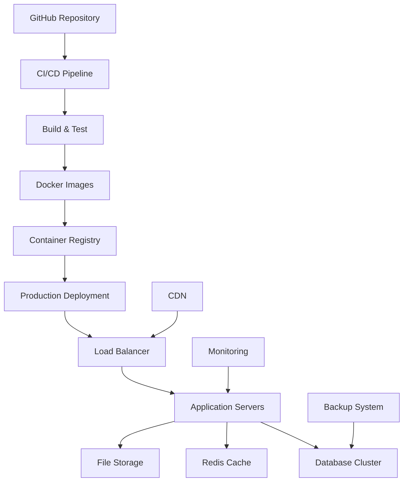

# 🚀 Guia de Deploy - CRM Pro Dashboard

## 📋 Índice

- [Visão Geral](#visão-geral)
- [Requisitos de Sistema](#requisitos-de-sistema)
- [Deploy em Produção](#deploy-em-produção)
- [Deploy com Docker](#deploy-com-docker)
- [Deploy na Vercel](#deploy-na-vercel)
- [Deploy na AWS](#deploy-na-aws)
- [Deploy no Digital Ocean](#deploy-no-digital-ocean)
- [Configuração de Domínio](#configuração-de-domínio)
- [SSL e Certificados](#ssl-e-certificados)
- [CDN e Cache](#cdn-e-cache)
- [Monitoramento](#monitoramento)
- [Backup e Disaster Recovery](#backup-e-disaster-recovery)
- [CI/CD Pipeline](#cicd-pipeline)
- [Troubleshooting](#troubleshooting)

---

## 🎯 Visão Geral

Este guia aborda todas as estratégias de deploy do CRM Pro Dashboard, desde ambientes de desenvolvimento até produção em larga escala.

### Arquitetura de Deploy



---

## 💻 Requisitos de Sistema

### Requisitos Mínimos

| Componente | Especificação Mínima | Recomendado |
|------------|----------------------|-------------|
| **CPU** | 2 vCPUs | 4+ vCPUs |
| **RAM** | 4 GB | 8+ GB |
| **Storage** | 50 GB SSD | 100+ GB NVMe |
| **Bandwidth** | 100 Mbps | 1 Gbps |
| **OS** | Ubuntu 20.04+ | Ubuntu 22.04 LTS |

### Dependências

```bash
# Dependências do sistema
sudo apt update && sudo apt upgrade -y
sudo apt install -y curl wget git unzip

# Node.js 18+
curl -fsSL https://deb.nodesource.com/setup_18.x | sudo -E bash -
sudo apt-get install -y nodejs

# Docker & Docker Compose
curl -fsSL https://get.docker.com -o get-docker.sh
sudo sh get-docker.sh
sudo curl -L "https://github.com/docker/compose/releases/download/v2.21.0/docker-compose-$(uname -s)-$(uname -m)" -o /usr/local/bin/docker-compose
sudo chmod +x /usr/local/bin/docker-compose

# Nginx
sudo apt install -y nginx

# PostgreSQL Client
sudo apt install -y postgresql-client
```

---

## 🏭 Deploy em Produção

### Preparação do Ambiente

```bash
#!/bin/bash
# setup-production.sh

# Criar usuário para aplicação
sudo adduser --system --group crm-dashboard
sudo usermod -aG docker crm-dashboard

# Criar diretórios
sudo mkdir -p /opt/crm-dashboard/{app,logs,backups,uploads}
sudo chown -R crm-dashboard:crm-dashboard /opt/crm-dashboard

# Configurar firewall
sudo ufw allow 22/tcp
sudo ufw allow 80/tcp
sudo ufw allow 443/tcp
sudo ufw --force enable

# Configurar limites do sistema
echo "crm-dashboard soft nofile 65536" | sudo tee -a /etc/security/limits.conf
echo "crm-dashboard hard nofile 65536" | sudo tee -a /etc/security/limits.conf

# Configurar kernel parameters
echo "net.core.somaxconn = 65536" | sudo tee -a /etc/sysctl.conf
echo "net.core.netdev_max_backlog = 5000" | sudo tee -a /etc/sysctl.conf
sudo sysctl -p
```

### Deploy Manual

```bash
#!/bin/bash
# deploy.sh

set -e

APP_DIR="/opt/crm-dashboard/app"
BACKUP_DIR="/opt/crm-dashboard/backups"
REPO_URL="https://github.com/seu-usuario/crm-dashboard.git"

echo "🚀 Iniciando deploy..."

# Backup da versão atual
if [ -d "$APP_DIR" ]; then
    echo "📦 Criando backup..."
    sudo tar -czf "$BACKUP_DIR/backup-$(date +%Y%m%d_%H%M%S).tar.gz" -C "$APP_DIR" .
fi

# Clonar/atualizar repositório
if [ ! -d "$APP_DIR" ]; then
    echo "📥 Clonando repositório..."
    sudo git clone "$REPO_URL" "$APP_DIR"
else
    echo "📥 Atualizando repositório..."
    cd "$APP_DIR"
    sudo git fetch origin
    sudo git reset --hard origin/main
fi

cd "$APP_DIR"

# Instalar dependências
echo "📦 Instalando dependências..."
sudo npm ci --only=production

# Build da aplicação
echo "🔨 Building aplicação..."
sudo npm run build

# Configurar variáveis de ambiente
if [ ! -f ".env.production" ]; then
    echo "⚙️ Configurando ambiente..."
    sudo cp .env.example .env.production
    echo "EDIT .env.production com suas configurações!"
    exit 1
fi

# Executar migrações
echo "🗄️ Executando migrações..."
sudo npm run db:migrate

# Restart dos serviços
echo "🔄 Reiniciando serviços..."
sudo systemctl restart nginx
sudo docker-compose down
sudo docker-compose up -d

# Verificar saúde da aplicação
echo "🏥 Verificando saúde..."
sleep 10
curl -f http://localhost:3000/api/health || {
    echo "❌ Falha no health check!"
    exit 1
}

echo "✅ Deploy concluído com sucesso!"
```

### Configuração do Systemd

```bash
# /etc/systemd/system/crm-dashboard.service
[Unit]
Description=CRM Dashboard Application
After=network.target postgresql.service

[Service]
Type=simple
User=crm-dashboard
Group=crm-dashboard
WorkingDirectory=/opt/crm-dashboard/app
Environment=NODE_ENV=production
Environment=PORT=3000
ExecStart=/usr/bin/npm start
Restart=always
RestartSec=10
StandardOutput=journal
StandardError=journal

[Install]
WantedBy=multi-user.target
```

```bash
# Ativar serviço
sudo systemctl daemon-reload
sudo systemctl enable crm-dashboard
sudo systemctl start crm-dashboard
sudo systemctl status crm-dashboard
```

---

## 🐳 Deploy com Docker

### Dockerfile Otimizado

```dockerfile
# Dockerfile.production
FROM node:18-alpine AS base

# Instalar dependências do sistema
RUN apk add --no-cache libc6-compat curl

# Definir diretório de trabalho
WORKDIR /app

# Copiar arquivos de dependências
COPY package*.json ./
COPY pnpm-lock.yaml ./

# Instalar pnpm
RUN npm install -g pnpm

# Stage para dependências
FROM base AS deps
RUN pnpm install --frozen-lockfile

# Stage para build
FROM base AS builder
COPY --from=deps /app/node_modules ./node_modules
COPY . .

# Build da aplicação
RUN pnpm build

# Limpar dependências de desenvolvimento
RUN pnpm install --frozen-lockfile --prod

# Stage final de produção
FROM node:18-alpine AS runner
WORKDIR /app

# Criar usuário não-root
RUN addgroup --system --gid 1001 nodejs
RUN adduser --system --uid 1001 nextjs

# Copiar arquivos necessários
COPY --from=builder /app/public ./public
COPY --from=builder /app/.next/standalone ./
COPY --from=builder /app/.next/static ./.next/static

# Configurar permissões
RUN chown -R nextjs:nodejs /app
USER nextjs

# Expor porta
EXPOSE 3000
ENV PORT 3000

# Health check
HEALTHCHECK --interval=30s --timeout=3s --start-period=5s --retries=3 \
    CMD curl -f http://localhost:3000/api/health || exit 1

# Comando de inicialização
CMD ["node", "server.js"]
```

### Docker Compose para Produção

```yaml
# docker-compose.production.yml
version: '3.8'

services:
  app:
    build:
      context: .
      dockerfile: Dockerfile.production
    container_name: crm-dashboard-app
    restart: unless-stopped
    ports:
      - "3000:3000"
    environment:
      - NODE_ENV=production
      - DATABASE_URL=${DATABASE_URL}
      - REDIS_URL=${REDIS_URL}
      - JWT_SECRET=${JWT_SECRET}
    depends_on:
      - postgres
      - redis
    volumes:
      - ./uploads:/app/uploads
      - ./logs:/app/logs
    networks:
      - crm-network
    logging:
      driver: "json-file"
      options:
        max-size: "10m"
        max-file: "3"

  postgres:
    image: postgres:15-alpine
    container_name: crm-dashboard-db
    restart: unless-stopped
    environment:
      - POSTGRES_DB=${POSTGRES_DB}
      - POSTGRES_USER=${POSTGRES_USER}
      - POSTGRES_PASSWORD=${POSTGRES_PASSWORD}
    volumes:
      - postgres_data:/var/lib/postgresql/data
      - ./backups:/backups
    ports:
      - "5432:5432"
    networks:
      - crm-network
    logging:
      driver: "json-file"
      options:
        max-size: "10m"
        max-file: "3"

  redis:
    image: redis:7-alpine
    container_name: crm-dashboard-redis
    restart: unless-stopped
    command: redis-server --appendonly yes --requirepass ${REDIS_PASSWORD}
    volumes:
      - redis_data:/data
    ports:
      - "6379:6379"
    networks:
      - crm-network

  nginx:
    image: nginx:alpine
    container_name: crm-dashboard-nginx
    restart: unless-stopped
    ports:
      - "80:80"
      - "443:443"
    volumes:
      - ./nginx/nginx.conf:/etc/nginx/nginx.conf:ro
      - ./nginx/ssl:/etc/nginx/ssl:ro
      - ./nginx/logs:/var/log/nginx
    depends_on:
      - app
    networks:
      - crm-network

volumes:
  postgres_data:
    driver: local
  redis_data:
    driver: local

networks:
  crm-network:
    driver: bridge
```

### Script de Deploy com Docker

```bash
#!/bin/bash
# docker-deploy.sh

set -e

echo "🐳 Iniciando deploy com Docker..."

# Verificar se Docker está rodando
if ! docker info > /dev/null 2>&1; then
    echo "❌ Docker não está rodando!"
    exit 1
fi

# Parar containers existentes
echo "🛑 Parando containers..."
docker-compose -f docker-compose.production.yml down

# Pull das imagens mais recentes
echo "📥 Atualizando imagens..."
docker-compose -f docker-compose.production.yml pull

# Build da aplicação
echo "🔨 Building aplicação..."
docker-compose -f docker-compose.production.yml build --no-cache

# Iniciar containers
echo "🚀 Iniciando containers..."
docker-compose -f docker-compose.production.yml up -d

# Aguardar serviços estarem prontos
echo "⏳ Aguardando serviços..."
sleep 30

# Verificar saúde
echo "🏥 Verificando saúde dos containers..."
docker-compose -f docker-compose.production.yml ps

# Health check da aplicação
echo "🔍 Verificando health check..."
timeout 60 bash -c 'until curl -f http://localhost/api/health; do sleep 2; done'

echo "✅ Deploy com Docker concluído!"
```

---

## ⚡ Deploy na Vercel

### Configuração da Vercel

```json
// vercel.json
{
  "version": 2,
  "name": "crm-dashboard",
  "alias": ["crmprodasboard.com", "www.crmprodasboard.com"],
  "builds": [
    {
      "src": "package.json",
      "use": "@vercel/next"
    }
  ],
  "routes": [
    {
      "src": "/api/(.*)",
      "dest": "/api/$1"
    },
    {
      "src": "/(.*)",
      "dest": "/$1"
    }
  ],
  "env": {
    "NODE_ENV": "production"
  },
  "functions": {
    "app/api/**/*.ts": {
      "maxDuration": 30
    }
  },
  "regions": ["gru1"],
  "framework": "nextjs"
}
```

### Deploy Script para Vercel

```bash
#!/bin/bash
# vercel-deploy.sh

echo "🚀 Deploy para Vercel..."

# Instalar Vercel CLI se necessário
if ! command -v vercel &> /dev/null; then
    echo "📦 Instalando Vercel CLI..."
    npm install -g vercel
fi

# Build local para verificar
echo "🔨 Testando build local..."
npm run build

# Deploy para preview
echo "📤 Deploy preview..."
vercel --env DATABASE_URL="$DATABASE_URL_PREVIEW" \
       --env REDIS_URL="$REDIS_URL_PREVIEW" \
       --env JWT_SECRET="$JWT_SECRET"

# Aguardar confirmação para produção
read -p "✅ Preview OK? Deploy para produção? (y/N): " -n 1 -r
echo
if [[ $REPLY =~ ^[Yy]$ ]]; then
    echo "🚀 Deploy para produção..."
    vercel --prod \
           --env DATABASE_URL="$DATABASE_URL_PROD" \
           --env REDIS_URL="$REDIS_URL_PROD" \
           --env JWT_SECRET="$JWT_SECRET_PROD"
    echo "✅ Deploy concluído!"
else
    echo "❌ Deploy cancelado."
fi
```

---

## ☁️ Deploy na AWS

### Configuração do EC2

```bash
#!/bin/bash
# aws-setup.sh

# Configurar instância EC2
echo "🔧 Configurando EC2..."

# Atualizar sistema
sudo yum update -y
sudo yum install -y docker git

# Iniciar Docker
sudo systemctl start docker
sudo systemctl enable docker
sudo usermod -aG docker ec2-user

# Instalar Docker Compose
sudo curl -L "https://github.com/docker/compose/releases/download/v2.21.0/docker-compose-$(uname -s)-$(uname -m)" -o /usr/local/bin/docker-compose
sudo chmod +x /usr/local/bin/docker-compose

# Configurar Application Load Balancer
# (via AWS CLI ou Console)
aws elbv2 create-load-balancer \
    --name crm-dashboard-alb \
    --subnets subnet-12345678 subnet-87654321 \
    --security-groups sg-12345678

# Configurar Target Group
aws elbv2 create-target-group \
    --name crm-dashboard-targets \
    --protocol HTTP \
    --port 3000 \
    --vpc-id vpc-12345678 \
    --health-check-path /api/health
```

### CloudFormation Template

```yaml
# cloudformation.yml
AWSTemplateFormatVersion: '2010-09-09'
Description: 'CRM Dashboard Infrastructure'

Parameters:
  KeyName:
    Type: AWS::EC2::KeyPair::KeyName
    Description: EC2 Key Pair for SSH access

Resources:
  VPC:
    Type: AWS::EC2::VPC
    Properties:
      CidrBlock: 10.0.0.0/16
      EnableDnsHostnames: true
      EnableDnsSupport: true
      Tags:
        - Key: Name
          Value: CRM-Dashboard-VPC

  InternetGateway:
    Type: AWS::EC2::InternetGateway
    Properties:
      Tags:
        - Key: Name
          Value: CRM-Dashboard-IGW

  AttachGateway:
    Type: AWS::EC2::VPCGatewayAttachment
    Properties:
      VpcId: !Ref VPC
      InternetGatewayId: !Ref InternetGateway

  PublicSubnet1:
    Type: AWS::EC2::Subnet
    Properties:
      VpcId: !Ref VPC
      CidrBlock: 10.0.1.0/24
      AvailabilityZone: !Select [0, !GetAZs '']
      MapPublicIpOnLaunch: true

  PublicSubnet2:
    Type: AWS::EC2::Subnet
    Properties:
      VpcId: !Ref VPC
      CidrBlock: 10.0.2.0/24
      AvailabilityZone: !Select [1, !GetAZs '']
      MapPublicIpOnLaunch: true

  ApplicationLoadBalancer:
    Type: AWS::ElasticLoadBalancingV2::LoadBalancer
    Properties:
      Name: crm-dashboard-alb
      Scheme: internet-facing
      SecurityGroups:
        - !Ref ALBSecurityGroup
      Subnets:
        - !Ref PublicSubnet1
        - !Ref PublicSubnet2

  TargetGroup:
    Type: AWS::ElasticLoadBalancingV2::TargetGroup
    Properties:
      Name: crm-dashboard-targets
      Port: 3000
      Protocol: HTTP
      VpcId: !Ref VPC
      HealthCheckPath: /api/health
      HealthCheckProtocol: HTTP
      HealthCheckIntervalSeconds: 30
      HealthyThresholdCount: 2
      UnhealthyThresholdCount: 5

  Listener:
    Type: AWS::ElasticLoadBalancingV2::Listener
    Properties:
      DefaultActions:
        - Type: forward
          TargetGroupArn: !Ref TargetGroup
      LoadBalancerArn: !Ref ApplicationLoadBalancer
      Port: 80
      Protocol: HTTP

  LaunchTemplate:
    Type: AWS::EC2::LaunchTemplate
    Properties:
      LaunchTemplateName: crm-dashboard-template
      LaunchTemplateData:
        ImageId: ami-0c02fb55956c7d316  # Amazon Linux 2
        InstanceType: t3.medium
        KeyName: !Ref KeyName
        SecurityGroupIds:
          - !Ref EC2SecurityGroup
        UserData:
          Fn::Base64: !Sub |
            #!/bin/bash
            yum update -y
            yum install -y docker git
            systemctl start docker
            systemctl enable docker
            usermod -aG docker ec2-user
            
            # Deploy da aplicação
            cd /home/ec2-user
            git clone https://github.com/seu-usuario/crm-dashboard.git
            cd crm-dashboard
            docker-compose -f docker-compose.production.yml up -d

  AutoScalingGroup:
    Type: AWS::AutoScaling::AutoScalingGroup
    Properties:
      AutoScalingGroupName: crm-dashboard-asg
      LaunchTemplate:
        LaunchTemplateId: !Ref LaunchTemplate
        Version: !GetAtt LaunchTemplate.LatestVersionNumber
      MinSize: 1
      MaxSize: 5
      DesiredCapacity: 2
      VPCZoneIdentifier:
        - !Ref PublicSubnet1
        - !Ref PublicSubnet2
      TargetGroupARNs:
        - !Ref TargetGroup
      HealthCheckType: ELB
      HealthCheckGracePeriod: 300

Outputs:
  LoadBalancerDNS:
    Description: DNS name of the load balancer
    Value: !GetAtt ApplicationLoadBalancer.DNSName
```

---

## 🌊 Deploy no Digital Ocean

### Configuração do Droplet

```bash
#!/bin/bash
# digitalocean-setup.sh

echo "🌊 Configurando Digital Ocean Droplet..."

# Atualizar sistema
sudo apt update && sudo apt upgrade -y

# Instalar dependências
sudo apt install -y curl wget git unzip nginx certbot python3-certbot-nginx

# Instalar Docker
curl -fsSL https://get.docker.com -o get-docker.sh
sudo sh get-docker.sh
sudo usermod -aG docker $USER

# Instalar Docker Compose
sudo curl -L "https://github.com/docker/compose/releases/download/v2.21.0/docker-compose-$(uname -s)-$(uname -m)" -o /usr/local/bin/docker-compose
sudo chmod +x /usr/local/bin/docker-compose

# Configurar firewall
sudo ufw allow OpenSSH
sudo ufw allow 'Nginx Full'
sudo ufw --force enable

# Configurar Nginx
sudo tee /etc/nginx/sites-available/crm-dashboard << EOF
server {
    listen 80;
    server_name crmprodasboard.com www.crmprodasboard.com;

    location / {
        proxy_pass http://localhost:3000;
        proxy_http_version 1.1;
        proxy_set_header Upgrade \$http_upgrade;
        proxy_set_header Connection 'upgrade';
        proxy_set_header Host \$host;
        proxy_set_header X-Real-IP \$remote_addr;
        proxy_set_header X-Forwarded-For \$proxy_add_x_forwarded_for;
        proxy_set_header X-Forwarded-Proto \$scheme;
        proxy_cache_bypass \$http_upgrade;
    }
}
EOF

sudo ln -s /etc/nginx/sites-available/crm-dashboard /etc/nginx/sites-enabled/
sudo nginx -t
sudo systemctl restart nginx

echo "✅ Configuração concluída!"
```

### App Platform Configuration

```yaml
# .do/app.yaml
name: crm-dashboard
services:
- name: web
  source_dir: /
  github:
    repo: seu-usuario/crm-dashboard
    branch: main
    deploy_on_push: true
  run_command: npm start
  environment_slug: node-js
  instance_count: 2
  instance_size_slug: basic-xxs
  env:
  - key: NODE_ENV
    value: production
  - key: DATABASE_URL
    scope: RUN_AND_BUILD_TIME
    type: SECRET
  - key: REDIS_URL
    scope: RUN_AND_BUILD_TIME
    type: SECRET
  - key: JWT_SECRET
    scope: RUN_AND_BUILD_TIME
    type: SECRET

databases:
- name: crm-db
  engine: PG
  version: "13"
  size: db-s-1vcpu-1gb

jobs:
- name: migration
  source_dir: /
  github:
    repo: seu-usuario/crm-dashboard
    branch: main
  run_command: npm run db:migrate
  environment_slug: node-js
```

---

## 🌐 Configuração de Domínio

### DNS Configuration

```bash
# Configuração DNS
# A Record
crmprodasboard.com.          300 IN A     159.89.123.456
www.crmprodasboard.com.      300 IN A     159.89.123.456

# CNAME Records
api.crmprodasboard.com.      300 IN CNAME crmprodasboard.com.
app.crmprodasboard.com.      300 IN CNAME crmprodasboard.com.

# MX Records
crmprodasboard.com.          300 IN MX    10 mail.crmprodasboard.com.

# TXT Records (SPF, DKIM, DMARC)
crmprodasboard.com.          300 IN TXT   "v=spf1 include:_spf.google.com ~all"
_dmarc.crmprodasboard.com.   300 IN TXT   "v=DMARC1; p=quarantine; rua=mailto:dmarc@crmprodasboard.com"
```

### Configuração de Subdomínios

```nginx
# /etc/nginx/sites-available/subdomains
# API Subdomain
server {
    listen 80;
    server_name api.crmprodasboard.com;
    
    location / {
        proxy_pass http://localhost:3000/api;
        proxy_set_header Host $host;
        proxy_set_header X-Real-IP $remote_addr;
        proxy_set_header X-Forwarded-For $proxy_add_x_forwarded_for;
        proxy_set_header X-Forwarded-Proto $scheme;
    }
}

# App Subdomain
server {
    listen 80;
    server_name app.crmprodasboard.com;
    
    location / {
        proxy_pass http://localhost:3000;
        proxy_set_header Host $host;
        proxy_set_header X-Real-IP $remote_addr;
        proxy_set_header X-Forwarded-For $proxy_add_x_forwarded_for;
        proxy_set_header X-Forwarded-Proto $scheme;
    }
}
```

---

## 🔒 SSL e Certificados

### Let's Encrypt com Certbot

```bash
#!/bin/bash
# ssl-setup.sh

echo "🔒 Configurando SSL com Let's Encrypt..."

# Instalar Certbot
sudo apt install -y certbot python3-certbot-nginx

# Obter certificados
sudo certbot --nginx -d crmprodasboard.com -d www.crmprodasboard.com

# Configurar renovação automática
sudo crontab -e
# Adicionar linha:
# 0 12 * * * /usr/bin/certbot renew --quiet

# Verificar certificado
sudo certbot certificates

echo "✅ SSL configurado com sucesso!"
```

### Configuração SSL Manual

```nginx
# /etc/nginx/sites-available/crm-dashboard-ssl
server {
    listen 443 ssl http2;
    server_name crmprodasboard.com www.crmprodasboard.com;
    
    # SSL Configuration
    ssl_certificate /etc/ssl/certs/crmprodasboard.com.crt;
    ssl_certificate_key /etc/ssl/private/crmprodasboard.com.key;
    
    # SSL Security
    ssl_protocols TLSv1.2 TLSv1.3;
    ssl_ciphers ECDHE-RSA-AES128-GCM-SHA256:ECDHE-RSA-AES256-GCM-SHA384;
    ssl_prefer_server_ciphers off;
    ssl_session_cache shared:SSL:10m;
    ssl_session_timeout 10m;
    
    # Security Headers
    add_header Strict-Transport-Security "max-age=63072000" always;
    add_header X-Frame-Options DENY;
    add_header X-Content-Type-Options nosniff;
    add_header X-XSS-Protection "1; mode=block";
    
    location / {
        proxy_pass http://localhost:3000;
        proxy_http_version 1.1;
        proxy_set_header Upgrade $http_upgrade;
        proxy_set_header Connection 'upgrade';
        proxy_set_header Host $host;
        proxy_set_header X-Real-IP $remote_addr;
        proxy_set_header X-Forwarded-For $proxy_add_x_forwarded_for;
        proxy_set_header X-Forwarded-Proto $scheme;
        proxy_cache_bypass $http_upgrade;
    }
}

# Redirect HTTP to HTTPS
server {
    listen 80;
    server_name crmprodasboard.com www.crmprodasboard.com;
    return 301 https://$server_name$request_uri;
}
```

---

## 🚀 CDN e Cache

### Configuração do CloudFlare

```javascript
// cloudflare-cache-rules.js
const cacheRules = {
  // Cache static assets for 1 year
  "*.js": "public, max-age=31536000, immutable",
  "*.css": "public, max-age=31536000, immutable",
  "*.png": "public, max-age=31536000, immutable",
  "*.jpg": "public, max-age=31536000, immutable",
  "*.svg": "public, max-age=31536000, immutable",
  
  // Cache API responses for 5 minutes
  "/api/*": "public, max-age=300, s-maxage=300",
  
  // No cache for auth endpoints
  "/api/auth/*": "no-cache, no-store, must-revalidate",
  
  // Cache HTML for 1 hour
  "*.html": "public, max-age=3600, s-maxage=3600"
};
```

### Nginx Cache Configuration

```nginx
# /etc/nginx/nginx.conf
http {
    # Cache zones
    proxy_cache_path /var/cache/nginx levels=1:2 keys_zone=api_cache:10m max_size=1g inactive=60m use_temp_path=off;
    
    # Rate limiting
    limit_req_zone $binary_remote_addr zone=api:10m rate=10r/s;
    limit_req_zone $binary_remote_addr zone=auth:10m rate=5r/s;
    
    server {
        listen 443 ssl http2;
        server_name crmprodasboard.com;
        
        # Static files cache
        location ~* \.(js|css|png|jpg|jpeg|gif|ico|svg)$ {
            expires 1y;
            add_header Cache-Control "public, immutable";
            add_header X-Cache-Status $upstream_cache_status;
        }
        
        # API cache
        location /api/ {
            limit_req zone=api burst=20 nodelay;
            
            proxy_cache api_cache;
            proxy_cache_valid 200 5m;
            proxy_cache_valid 404 1m;
            proxy_cache_use_stale error timeout updating http_500 http_502 http_503 http_504;
            proxy_cache_lock on;
            
            add_header X-Cache-Status $upstream_cache_status;
            
            proxy_pass http://localhost:3000;
        }
        
        # Auth endpoints - no cache
        location /api/auth/ {
            limit_req zone=auth burst=10 nodelay;
            
            proxy_cache off;
            add_header Cache-Control "no-cache, no-store, must-revalidate";
            
            proxy_pass http://localhost:3000;
        }
    }
}
```

---

## 📊 Monitoramento

### Configuração do Prometheus

```yaml
# prometheus.yml
global:
  scrape_interval: 15s
  evaluation_interval: 15s

scrape_configs:
  - job_name: 'crm-dashboard'
    static_configs:
      - targets: ['localhost:3000']
    metrics_path: '/api/metrics'
    scrape_interval: 30s

  - job_name: 'nginx'
    static_configs:
      - targets: ['localhost:9113']

  - job_name: 'postgres'
    static_configs:
      - targets: ['localhost:9187']

  - job_name: 'redis'
    static_configs:
      - targets: ['localhost:9121']
```

### Configuração do Grafana

```yaml
# grafana-dashboard.json
{
  "dashboard": {
    "id": null,
    "title": "CRM Dashboard Metrics",
    "panels": [
      {
        "title": "Response Time",
        "type": "graph",
        "targets": [
          {
            "expr": "histogram_quantile(0.95, http_request_duration_seconds_bucket{job=\"crm-dashboard\"})"
          }
        ]
      },
      {
        "title": "Request Rate",
        "type": "graph",
        "targets": [
          {
            "expr": "rate(http_requests_total{job=\"crm-dashboard\"}[5m])"
          }
        ]
      },
      {
        "title": "Error Rate",
        "type": "graph",
        "targets": [
          {
            "expr": "rate(http_requests_total{job=\"crm-dashboard\",status=~\"5..\"}[5m])"
          }
        ]
      }
    ]
  }
}
```

---

## 💾 Backup e Disaster Recovery

### Script de Backup Automatizado

```bash
#!/bin/bash
# backup.sh

BACKUP_DIR="/opt/crm-dashboard/backups"
DATE=$(date +%Y%m%d_%H%M%S)
RETENTION_DAYS=7

echo "📦 Iniciando backup..."

# Backup do banco de dados
pg_dump -h localhost -U postgres -d crm_dashboard > "$BACKUP_DIR/db_$DATE.sql"

# Backup de arquivos de upload
tar -czf "$BACKUP_DIR/uploads_$DATE.tar.gz" /opt/crm-dashboard/uploads

# Backup de configurações
tar -czf "$BACKUP_DIR/config_$DATE.tar.gz" \
    /etc/nginx/sites-available/crm-dashboard \
    /opt/crm-dashboard/app/.env.production \
    /opt/crm-dashboard/app/docker-compose.production.yml

# Enviar para S3
aws s3 sync "$BACKUP_DIR" s3://crm-dashboard-backups/$(date +%Y/%m/%d)/

# Limpar backups antigos
find "$BACKUP_DIR" -name "*.sql" -mtime +$RETENTION_DAYS -delete
find "$BACKUP_DIR" -name "*.tar.gz" -mtime +$RETENTION_DAYS -delete

echo "✅ Backup concluído!"
```

### Plano de Disaster Recovery

```yaml
# disaster-recovery-plan.yml
recovery_procedures:
  data_loss:
    rto: "2 hours"  # Recovery Time Objective
    rpo: "1 hour"   # Recovery Point Objective
    steps:
      - "Identificar escopo da perda"
      - "Restaurar último backup válido"
      - "Aplicar logs de transação se disponíveis"
      - "Validar integridade dos dados"
      - "Reiniciar serviços"
      - "Verificar funcionalidades críticas"
  
  infrastructure_failure:
    rto: "4 hours"
    rpo: "1 hour"
    steps:
      - "Ativar ambiente de backup"
      - "Atualizar registros DNS"
      - "Restaurar dados do backup"
      - "Configurar load balancer"
      - "Executar testes de smoke"
      - "Notificar usuários"
```

---

## 🔄 CI/CD Pipeline

### GitHub Actions

```yaml
# .github/workflows/deploy.yml
name: Deploy to Production

on:
  push:
    branches: [main]

jobs:
  test:
    runs-on: ubuntu-latest
    steps:
      - uses: actions/checkout@v3
      
      - name: Setup Node.js
        uses: actions/setup-node@v3
        with:
          node-version: '18'
          cache: 'npm'
      
      - name: Install dependencies
        run: npm ci
      
      - name: Run tests
        run: npm test
      
      - name: Run E2E tests
        run: npm run test:e2e

  build:
    needs: test
    runs-on: ubuntu-latest
    steps:
      - uses: actions/checkout@v3
      
      - name: Build Docker image
        run: |
          docker build -t crm-dashboard:${{ github.sha }} -f Dockerfile.production .
          docker tag crm-dashboard:${{ github.sha }} crm-dashboard:latest
      
      - name: Push to registry
        run: |
          echo ${{ secrets.DOCKER_PASSWORD }} | docker login -u ${{ secrets.DOCKER_USERNAME }} --password-stdin
          docker push crm-dashboard:${{ github.sha }}
          docker push crm-dashboard:latest

  deploy:
    needs: build
    runs-on: ubuntu-latest
    environment: production
    steps:
      - name: Deploy to server
        uses: appleboy/ssh-action@v0.1.5
        with:
          host: ${{ secrets.HOST }}
          username: ${{ secrets.USERNAME }}
          key: ${{ secrets.SSH_KEY }}
          script: |
            cd /opt/crm-dashboard/app
            docker-compose -f docker-compose.production.yml pull
            docker-compose -f docker-compose.production.yml up -d
            docker system prune -f
```

### GitLab CI/CD

```yaml
# .gitlab-ci.yml
stages:
  - test
  - build
  - deploy

variables:
  DOCKER_IMAGE: $CI_REGISTRY_IMAGE
  DOCKER_TAG: $CI_COMMIT_SHA

test:
  stage: test
  image: node:18
  script:
    - npm ci
    - npm run test
    - npm run test:e2e
  coverage: '/All files[^|]*\|[^|]*\s+([\d\.]+)/'

build:
  stage: build
  image: docker:latest
  services:
    - docker:dind
  script:
    - docker build -t $DOCKER_IMAGE:$DOCKER_TAG -f Dockerfile.production .
    - docker push $DOCKER_IMAGE:$DOCKER_TAG
  only:
    - main

deploy:
  stage: deploy
  image: alpine:latest
  before_script:
    - apk add --no-cache openssh-client
    - eval $(ssh-agent -s)
    - echo "$SSH_PRIVATE_KEY" | tr -d '\r' | ssh-add -
  script:
    - ssh -o StrictHostKeyChecking=no $SERVER_USER@$SERVER_HOST "
        cd /opt/crm-dashboard/app &&
        docker-compose -f docker-compose.production.yml pull &&
        docker-compose -f docker-compose.production.yml up -d &&
        docker system prune -f
      "
  only:
    - main
  when: manual
```

---

## 🔧 Troubleshooting

### Problemas Comuns

#### Aplicação não Inicia

```bash
# Verificar logs
docker-compose logs -f app

# Verificar variáveis de ambiente
docker-compose config

# Verificar conectividade do banco
docker-compose exec app npm run db:check

# Verificar portas em uso
sudo netstat -tulpn | grep :3000
```

#### Performance Lenta

```bash
# Verificar recursos do sistema
htop
df -h
free -h

# Verificar logs do nginx
tail -f /var/log/nginx/access.log
tail -f /var/log/nginx/error.log

# Verificar métricas do Docker
docker stats

# Analisar queries lentas do PostgreSQL
docker-compose exec postgres psql -U postgres -d crm_dashboard -c "
  SELECT query, mean_exec_time, calls 
  FROM pg_stat_statements 
  ORDER BY mean_exec_time DESC 
  LIMIT 10;
"
```

#### Problemas de Conectividade

```bash
# Verificar DNS
nslookup crmprodasboard.com

# Verificar SSL
openssl s_client -connect crmprodasboard.com:443

# Verificar firewall
sudo ufw status

# Testar conectividade interna
curl -I http://localhost:3000/api/health
```

#### Falhas de Deploy

```bash
# Rollback para versão anterior
docker-compose -f docker-compose.production.yml down
docker tag crm-dashboard:previous crm-dashboard:latest
docker-compose -f docker-compose.production.yml up -d

# Verificar espaço em disco
df -h
docker system df

# Limpar containers órfãos
docker container prune -f
docker image prune -f
docker volume prune -f
```

### Scripts de Diagnóstico

```bash
#!/bin/bash
# diagnostic.sh

echo "🔍 Executando diagnóstico do sistema..."

echo "## System Info"
uname -a
echo "Uptime: $(uptime)"
echo "Load Average: $(cat /proc/loadavg)"

echo "## Memory Usage"
free -h

echo "## Disk Usage"
df -h

echo "## Docker Status"
docker --version
docker-compose --version
docker ps --format "table {{.Names}}\t{{.Status}}\t{{.Ports}}"

echo "## Application Health"
curl -s http://localhost:3000/api/health | jq .

echo "## Recent Logs"
docker-compose logs --tail=20 app

echo "## Network Connectivity"
ping -c 3 8.8.8.8
nslookup crmprodasboard.com

echo "✅ Diagnóstico concluído!"
```

---

## 📞 Suporte

Para suporte com deploy:

- 📧 **Email**: devops@crmprodasboard.com
- 📚 **Documentação**: [docs.crmprodasboard.com/deployment](https://docs.crmprodasboard.com/deployment)
- 🐛 **Issues**: [GitHub Deploy Issues](https://github.com/seu-repo/issues)
- 💬 **Discord**: #deploy-help

---

*Última atualização: $(date +%d/%m/%Y)*
