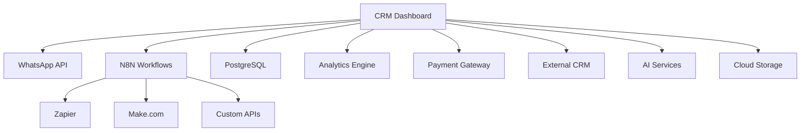

# 🔗 Guia de Integrações - CRM Pro Dashboard

## 📋 Índice

- [Visão Geral](#visão-geral)
- [Integrações Disponíveis](#integrações-disponíveis)
- [WhatsApp Business API](#whatsapp-business-api)
- [N8N Workflow Automation](#n8n-workflow-automation)
- [PostgreSQL Database](#postgresql-database)
- [Analytics & Monitoring](#analytics--monitoring)
- [Pagamentos & Billing](#pagamentos--billing)
- [CRM Externo](#crm-externo)
- [APIs de IA](#apis-de-ia)
- [Cloud Storage](#cloud-storage)
- [Configuração de Webhooks](#configuração-de-webhooks)
- [Autenticação OAuth](#autenticação-oauth)
- [Rate Limiting](#rate-limiting)
- [Monitoramento](#monitoramento)
- [Troubleshooting](#troubleshooting)

---

## 🎯 Visão Geral

O CRM Pro Dashboard foi projetado com uma arquitetura modular que suporta múltiplas integrações para maximizar a produtividade e automatização dos processos de negócio.

### Arquitetura de Integrações



---

## 🔌 Integrações Disponíveis

| Integração | Status | Tipo | Configuração |
|------------|--------|------|--------------|
| WhatsApp Business | ✅ Ativo | Messaging | Automática |
| N8N Workflows | ✅ Ativo | Automation | Manual |
| PostgreSQL | ✅ Ativo | Database | Automática |
| Google Analytics | ✅ Ativo | Analytics | OAuth |
| Stripe | 🚧 Beta | Payment | API Key |
| Salesforce | 📋 Planejado | CRM | OAuth |
| OpenAI | ✅ Ativo | AI | API Key |
| AWS S3 | ✅ Ativo | Storage | Credentials |
| SendGrid | ✅ Ativo | Email | API Key |
| Slack | 🚧 Beta | Notifications | OAuth |

---

## 📱 WhatsApp Business API

### Configuração Inicial

```javascript
// Configuração do WhatsApp WebJS
const whatsappConfig = {
  clientId: process.env.WHATSAPP_CLIENT_ID,
  puppeteer: {
    headless: true,
    args: ['--no-sandbox', '--disable-setuid-sandbox']
  },
  authStrategy: new LocalAuth({
    clientId: "client-one"
  }),
  webVersionCache: {
    type: 'remote',
    remotePath: 'https://raw.githubusercontent.com/wppconnect-team/wa-version/main/html/2.2412.54.html',
  }
};
```

### Funcionalidades Disponíveis

#### ✅ Mensagens
- Envio de mensagens de texto
- Envio de mídias (imagem, áudio, vídeo, documento)
- Mensagens em massa
- Templates de mensagens
- Auto-resposta inteligente

#### ✅ Grupos
- Criação e gerenciamento de grupos
- Adição/remoção de participantes
- Configuração de admins
- Mensagens para grupos

#### ✅ Contatos
- Sincronização automática
- Categorização de contatos
- Tags personalizadas
- Histórico de conversas

### Exemplo de Implementação

```javascript
// Envio de mensagem personalizada
async function sendCustomMessage(to, template, variables) {
  try {
    const message = await whatsappClient.sendMessage(to, {
      text: template.replace(/{{(\w+)}}/g, (match, key) => variables[key] || match)
    });
    
    await logMessage({
      messageId: message.id,
      to: to,
      template: template.name,
      status: 'sent',
      timestamp: new Date()
    });
    
    return message;
  } catch (error) {
    console.error('Erro ao enviar mensagem:', error);
    throw error;
  }
}
```

---

## ⚡ N8N Workflow Automation

### Configuração do Ambiente

```yaml
# docker-compose.yml para N8N
version: '3.8'
services:
  n8n:
    image: n8nio/n8n:latest
    ports:
      - "5678:5678"
    environment:
      - N8N_BASIC_AUTH_ACTIVE=true
      - N8N_BASIC_AUTH_USER=${N8N_USER}
      - N8N_BASIC_AUTH_PASSWORD=${N8N_PASSWORD}
      - N8N_HOST=${N8N_HOST}
      - N8N_PROTOCOL=https
      - WEBHOOK_URL=${N8N_WEBHOOK_URL}
    volumes:
      - n8n_data:/home/node/.n8n
    depends_on:
      - postgres
```

### Workflows Padrão

#### 🤖 Lead Management
```json
{
  "name": "Lead Qualification Workflow",
  "nodes": [
    {
      "name": "Webhook Trigger",
      "type": "n8n-nodes-base.webhook",
      "parameters": {
        "path": "lead-capture"
      }
    },
    {
      "name": "Score Lead",
      "type": "n8n-nodes-base.function",
      "parameters": {
        "functionCode": "// Cálculo de score do lead\nconst score = calculateLeadScore(items[0].json);\nreturn [{json: {...items[0].json, score}}];"
      }
    },
    {
      "name": "Send to CRM",
      "type": "n8n-nodes-base.httpRequest",
      "parameters": {
        "url": "https://api.crm.com/leads",
        "method": "POST"
      }
    }
  ]
}
```

#### 📧 Email Automation
```json
{
  "name": "Follow-up Email Sequence",
  "trigger": "schedule",
  "actions": [
    "fetch_inactive_leads",
    "send_personalized_email",
    "update_lead_status",
    "schedule_next_followup"
  ]
}
```

---

## 🗄️ PostgreSQL Database

### Schema Principal

```sql
-- Configuração das tabelas principais
CREATE SCHEMA crm_dashboard;

-- Tabela de usuários
CREATE TABLE crm_dashboard.users (
    id UUID PRIMARY KEY DEFAULT gen_random_uuid(),
    email VARCHAR(255) UNIQUE NOT NULL,
    password_hash VARCHAR(255) NOT NULL,
    role VARCHAR(50) DEFAULT 'user',
    created_at TIMESTAMP DEFAULT NOW(),
    updated_at TIMESTAMP DEFAULT NOW()
);

-- Tabela de contatos
CREATE TABLE crm_dashboard.contacts (
    id UUID PRIMARY KEY DEFAULT gen_random_uuid(),
    user_id UUID REFERENCES crm_dashboard.users(id),
    name VARCHAR(255) NOT NULL,
    phone VARCHAR(20),
    email VARCHAR(255),
    whatsapp_id VARCHAR(50),
    tags JSONB DEFAULT '[]',
    metadata JSONB DEFAULT '{}',
    created_at TIMESTAMP DEFAULT NOW(),
    updated_at TIMESTAMP DEFAULT NOW()
);

-- Tabela de mensagens
CREATE TABLE crm_dashboard.messages (
    id UUID PRIMARY KEY DEFAULT gen_random_uuid(),
    contact_id UUID REFERENCES crm_dashboard.contacts(id),
    content TEXT NOT NULL,
    type VARCHAR(20) DEFAULT 'text',
    direction VARCHAR(10) NOT NULL, -- 'in' ou 'out'
    whatsapp_message_id VARCHAR(100),
    status VARCHAR(20) DEFAULT 'sent',
    created_at TIMESTAMP DEFAULT NOW()
);
```

### Conexão e Pool

```javascript
// Configuração do pool de conexões
const { Pool } = require('pg');

const pool = new Pool({
  user: process.env.DB_USER,
  host: process.env.DB_HOST,
  database: process.env.DB_NAME,
  password: process.env.DB_PASSWORD,
  port: process.env.DB_PORT || 5432,
  max: 20,
  idleTimeoutMillis: 30000,
  connectionTimeoutMillis: 2000,
});

// Middleware para transações
async function withTransaction(callback) {
  const client = await pool.connect();
  try {
    await client.query('BEGIN');
    const result = await callback(client);
    await client.query('COMMIT');
    return result;
  } catch (error) {
    await client.query('ROLLBACK');
    throw error;
  } finally {
    client.release();
  }
}
```

---

## 📊 Analytics & Monitoring

### Google Analytics 4

```javascript
// Configuração GA4
import { GoogleAnalytics } from '@next/third-parties/google';

// Eventos personalizados
function trackCustomEvent(eventName, parameters) {
  gtag('event', eventName, {
    custom_parameter_1: parameters.value1,
    custom_parameter_2: parameters.value2,
    // ... outros parâmetros
  });
}

// Tracking de conversões
function trackConversion(type, value) {
  gtag('event', 'conversion', {
    send_to: 'AW-CONVERSION_ID/CONVERSION_LABEL',
    value: value,
    currency: 'BRL',
    transaction_id: generateTransactionId()
  });
}
```

### Métricas Personalizadas

```javascript
// Sistema de métricas interno
class MetricsCollector {
  static async collectDashboardMetrics() {
    return {
      activeUsers: await this.getActiveUsers(),
      messagesSent: await this.getMessageCount('24h'),
      conversionRate: await this.getConversionRate(),
      responseTime: await this.getAverageResponseTime(),
      botEfficiency: await this.getBotEfficiency()
    };
  }
  
  static async logUserAction(userId, action, metadata = {}) {
    await db.query(`
      INSERT INTO analytics.user_actions 
      (user_id, action, metadata, timestamp)
      VALUES ($1, $2, $3, NOW())
    `, [userId, action, metadata]);
  }
}
```

---

## 💳 Pagamentos & Billing

### Stripe Integration

```javascript
// Configuração do Stripe
const stripe = require('stripe')(process.env.STRIPE_SECRET_KEY);

// Criar sessão de checkout
async function createCheckoutSession(customerId, priceId) {
  const session = await stripe.checkout.sessions.create({
    customer: customerId,
    payment_method_types: ['card', 'pix'],
    line_items: [{
      price: priceId,
      quantity: 1,
    }],
    mode: 'subscription',
    success_url: `${process.env.DOMAIN}/billing/success?session_id={CHECKOUT_SESSION_ID}`,
    cancel_url: `${process.env.DOMAIN}/billing/cancel`,
    locale: 'pt-BR',
  });
  
  return session;
}

// Webhook do Stripe
app.post('/webhooks/stripe', express.raw({type: 'application/json'}), (req, res) => {
  const sig = req.headers['stripe-signature'];
  
  try {
    const event = stripe.webhooks.constructEvent(req.body, sig, process.env.STRIPE_WEBHOOK_SECRET);
    
    switch (event.type) {
      case 'invoice.payment_succeeded':
        handleSuccessfulPayment(event.data.object);
        break;
      case 'customer.subscription.deleted':
        handleSubscriptionCancellation(event.data.object);
        break;
      default:
        console.log(`Unhandled event type ${event.type}`);
    }
    
    res.json({received: true});
  } catch (err) {
    console.log('Webhook signature verification failed.', err.message);
    res.status(400).send(`Webhook Error: ${err.message}`);
  }
});
```

---

## 🤖 APIs de IA

### OpenAI Integration

```javascript
// Configuração OpenAI
const OpenAI = require('openai');

const openai = new OpenAI({
  apiKey: process.env.OPENAI_API_KEY,
});

// Geração de respostas automáticas
async function generateAutoResponse(message, context) {
  const completion = await openai.chat.completions.create({
    model: "gpt-4",
    messages: [
      {
        role: "system",
        content: `Você é um assistente de atendimento ao cliente especializado em ${context.business_type}. 
        Responda de forma profissional, empática e útil. Mantenha as respostas concisas.`
      },
      {
        role: "user",
        content: message
      }
    ],
    max_tokens: 150,
    temperature: 0.7,
  });
  
  return completion.choices[0].message.content;
}

// Análise de sentimento
async function analyzeSentiment(text) {
  const completion = await openai.chat.completions.create({
    model: "gpt-3.5-turbo",
    messages: [
      {
        role: "system",
        content: "Analise o sentimento do texto e retorne apenas: positivo, negativo ou neutro"
      },
      {
        role: "user",
        content: text
      }
    ],
    max_tokens: 10,
    temperature: 0.1,
  });
  
  return completion.choices[0].message.content.trim().toLowerCase();
}
```

---

## ☁️ Cloud Storage

### AWS S3 Integration

```javascript
// Configuração AWS S3
const AWS = require('aws-sdk');

const s3 = new AWS.S3({
  accessKeyId: process.env.AWS_ACCESS_KEY_ID,
  secretAccessKey: process.env.AWS_SECRET_ACCESS_KEY,
  region: process.env.AWS_REGION
});

// Upload de mídia
async function uploadMedia(file, folder = 'media') {
  const uploadParams = {
    Bucket: process.env.S3_BUCKET_NAME,
    Key: `${folder}/${Date.now()}-${file.originalname}`,
    Body: file.buffer,
    ContentType: file.mimetype,
    ACL: 'public-read'
  };
  
  try {
    const result = await s3.upload(uploadParams).promise();
    return {
      success: true,
      url: result.Location,
      key: result.Key
    };
  } catch (error) {
    console.error('Erro no upload:', error);
    throw new Error('Falha no upload do arquivo');
  }
}

// Gerar URL pré-assinada
async function generatePresignedUrl(key, expires = 3600) {
  return s3.getSignedUrl('getObject', {
    Bucket: process.env.S3_BUCKET_NAME,
    Key: key,
    Expires: expires
  });
}
```

---

## 🔗 Configuração de Webhooks

### Sistema de Webhooks

```javascript
// Registro de webhooks
class WebhookManager {
  static async registerWebhook(url, events, secret) {
    const webhook = await db.query(`
      INSERT INTO webhooks (url, events, secret, active, created_at)
      VALUES ($1, $2, $3, true, NOW())
      RETURNING id
    `, [url, JSON.stringify(events), secret]);
    
    return webhook.rows[0].id;
  }
  
  static async triggerWebhook(event, data) {
    const webhooks = await db.query(`
      SELECT * FROM webhooks 
      WHERE active = true AND events @> $1
    `, [JSON.stringify([event])]);
    
    for (const webhook of webhooks.rows) {
      await this.sendWebhook(webhook, event, data);
    }
  }
  
  static async sendWebhook(webhook, event, data) {
    const payload = {
      event,
      data,
      timestamp: new Date().toISOString(),
      signature: this.generateSignature(data, webhook.secret)
    };
    
    try {
      const response = await fetch(webhook.url, {
        method: 'POST',
        headers: {
          'Content-Type': 'application/json',
          'X-Webhook-Signature': payload.signature
        },
        body: JSON.stringify(payload)
      });
      
      await this.logWebhookDelivery(webhook.id, response.status, payload);
    } catch (error) {
      await this.logWebhookError(webhook.id, error.message);
    }
  }
}
```

---

## 🔐 Autenticação OAuth

### Fluxo OAuth 2.0

```javascript
// Configuração OAuth providers
const oauthProviders = {
  google: {
    clientId: process.env.GOOGLE_CLIENT_ID,
    clientSecret: process.env.GOOGLE_CLIENT_SECRET,
    redirectUri: `${process.env.DOMAIN}/auth/google/callback`,
    scopes: ['profile', 'email', 'https://www.googleapis.com/auth/analytics.readonly']
  },
  salesforce: {
    clientId: process.env.SALESFORCE_CLIENT_ID,
    clientSecret: process.env.SALESFORCE_CLIENT_SECRET,
    redirectUri: `${process.env.DOMAIN}/auth/salesforce/callback`,
    scopes: ['api', 'refresh_token']
  }
};

// Middleware de autenticação
async function authenticateOAuth(provider, code) {
  const config = oauthProviders[provider];
  
  const tokenResponse = await fetch(`https://oauth2.googleapis.com/token`, {
    method: 'POST',
    headers: { 'Content-Type': 'application/x-www-form-urlencoded' },
    body: new URLSearchParams({
      code,
      client_id: config.clientId,
      client_secret: config.clientSecret,
      redirect_uri: config.redirectUri,
      grant_type: 'authorization_code'
    })
  });
  
  const tokens = await tokenResponse.json();
  
  // Armazenar tokens de forma segura
  await storeTokens(provider, tokens);
  
  return tokens;
}
```

---

## ⚠️ Rate Limiting

### Implementação de Rate Limiting

```javascript
// Rate limiting com Redis
const Redis = require('redis');
const redis = Redis.createClient(process.env.REDIS_URL);

class RateLimiter {
  static async checkLimit(key, maxRequests = 100, windowMs = 900000) { // 15 min
    const current = await redis.incr(key);
    
    if (current === 1) {
      await redis.expire(key, Math.ceil(windowMs / 1000));
    }
    
    return {
      allowed: current <= maxRequests,
      count: current,
      limit: maxRequests,
      resetTime: await redis.ttl(key)
    };
  }
  
  static async applyRateLimit(req, res, next) {
    const key = `rate_limit:${req.ip}:${req.route.path}`;
    const limit = await this.checkLimit(key);
    
    res.set({
      'X-RateLimit-Limit': limit.limit,
      'X-RateLimit-Remaining': Math.max(0, limit.limit - limit.count),
      'X-RateLimit-Reset': new Date(Date.now() + limit.resetTime * 1000)
    });
    
    if (!limit.allowed) {
      return res.status(429).json({
        error: 'Too Many Requests',
        message: 'Rate limit exceeded',
        retryAfter: limit.resetTime
      });
    }
    
    next();
  }
}
```

---

## 📱 Monitoramento

### Health Checks

```javascript
// Sistema de health checks
const healthChecks = {
  database: async () => {
    try {
      await db.query('SELECT 1');
      return { status: 'healthy', latency: Date.now() };
    } catch (error) {
      return { status: 'unhealthy', error: error.message };
    }
  },
  
  whatsapp: async () => {
    try {
      const state = await whatsappClient.getState();
      return { status: state === 'CONNECTED' ? 'healthy' : 'unhealthy', state };
    } catch (error) {
      return { status: 'unhealthy', error: error.message };
    }
  },
  
  n8n: async () => {
    try {
      const response = await fetch(`${process.env.N8N_URL}/healthz`);
      return { status: response.ok ? 'healthy' : 'unhealthy' };
    } catch (error) {
      return { status: 'unhealthy', error: error.message };
    }
  }
};

// Endpoint de status
app.get('/health', async (req, res) => {
  const checks = {};
  const promises = Object.entries(healthChecks).map(async ([name, check]) => {
    checks[name] = await check();
  });
  
  await Promise.all(promises);
  
  const overall = Object.values(checks).every(c => c.status === 'healthy') 
    ? 'healthy' : 'unhealthy';
  
  res.status(overall === 'healthy' ? 200 : 503).json({
    status: overall,
    timestamp: new Date().toISOString(),
    checks
  });
});
```

---

## 🔧 Troubleshooting

### Problemas Comuns

#### WhatsApp Desconectado
```bash
# Verificar status
curl -X GET http://localhost:3000/api/whatsapp/status

# Restart do serviço
pm2 restart whatsapp-service

# Logs detalhados
tail -f logs/whatsapp.log
```

#### Falhas na Base de Dados
```sql
-- Verificar conexões ativas
SELECT count(*) FROM pg_stat_activity;

-- Terminar conexões pendentes
SELECT pg_terminate_backend(pid) 
FROM pg_stat_activity 
WHERE state = 'idle' AND state_change < now() - interval '1 hour';
```

#### N8N Workflows com Erro
```bash
# Restart N8N
docker-compose restart n8n

# Verificar logs
docker-compose logs -f n8n

# Backup dos workflows
curl -X GET http://localhost:5678/api/v1/workflows \
  -H "Authorization: Bearer YOUR_API_KEY"
```

### Logs e Debugging

```javascript
// Sistema de logs estruturado
const winston = require('winston');

const logger = winston.createLogger({
  level: 'info',
  format: winston.format.combine(
    winston.format.timestamp(),
    winston.format.errors({ stack: true }),
    winston.format.json()
  ),
  defaultMeta: { service: 'crm-dashboard' },
  transports: [
    new winston.transports.File({ filename: 'logs/error.log', level: 'error' }),
    new winston.transports.File({ filename: 'logs/combined.log' }),
    new winston.transports.Console({
      format: winston.format.simple()
    })
  ]
});

// Uso nos endpoints
app.use((req, res, next) => {
  logger.info('Request received', {
    method: req.method,
    url: req.url,
    ip: req.ip,
    userAgent: req.get('User-Agent')
  });
  next();
});
```

---

## 📞 Suporte

Para suporte técnico com integrações:

- 📧 **Email**: suporte@crmprodasboard.com
- 💬 **WhatsApp**: +55 11 99999-9999
- 📚 **Documentação**: [docs.crmprodasboard.com](https://docs.crmprodasboard.com)
- 🐛 **Issues**: [GitHub Issues](https://github.com/seu-repo/issues)

---

*Última atualização: $(date +%d/%m/%Y)*
