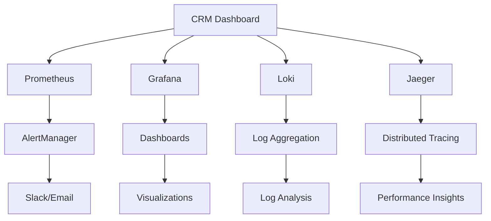

# 📊 Monitoring & Observability - CRM Pro Dashboard

<div align="center">


**Monitoramento completo e observabilidade para o CRM Pro Dashboard**

</div>

---

## 🎯 Visão Geral

Este guia aborda a implementação completa de monitoramento, observabilidade e alertas para o CRM Pro Dashboard, garantindo alta disponibilidade e performance otimizada.

---

## 🏗️ Arquitetura de Monitoramento

### Stack de Observabilidade



### Componentes Principais

| Componente | Função | Port | Status |
|------------|--------|------|--------|
| **Prometheus** | Metrics Collection | 9090 | ✅ |
| **Grafana** | Visualization | 3001 | ✅ |
| **Loki** | Log Aggregation | 3100 | ✅ |
| **Jaeger** | Distributed Tracing | 16686 | ✅ |
| **AlertManager** | Alert Routing | 9093 | ✅ |
| **Node Exporter** | System Metrics | 9100 | ✅ |
| **Cadvisor** | Container Metrics | 8080 | ✅ |

---

## 🐳 Configuração Docker

### Docker Compose - Monitoring Stack

```yaml
version: '3.8'

services:
  # Prometheus - Metrics Collection
  prometheus:
    image: prom/prometheus:latest
    container_name: prometheus
    ports:
      - "9090:9090"
    volumes:
      - ./monitoring/prometheus:/etc/prometheus
      - prometheus_data:/prometheus
    command:
      - '--config.file=/etc/prometheus/prometheus.yml'
      - '--storage.tsdb.path=/prometheus'
      - '--web.console.libraries=/etc/prometheus/console_libraries'
      - '--web.console.templates=/etc/prometheus/consoles'
      - '--storage.tsdb.retention.time=30d'
      - '--web.enable-lifecycle'
    networks:
      - monitoring

  # Grafana - Visualization
  grafana:
    image: grafana/grafana:latest
    container_name: grafana
    ports:
      - "3001:3000"
    environment:
      - GF_SECURITY_ADMIN_PASSWORD=admin123
      - GF_INSTALL_PLUGINS=grafana-clock-panel,grafana-simple-json-datasource
    volumes:
      - grafana_data:/var/lib/grafana
      - ./monitoring/grafana:/etc/grafana/provisioning
    networks:
      - monitoring

  # Loki - Log Aggregation
  loki:
    image: grafana/loki:latest
    container_name: loki
    ports:
      - "3100:3100"
    volumes:
      - ./monitoring/loki:/etc/loki
      - loki_data:/loki
    command: -config.file=/etc/loki/local-config.yaml
    networks:
      - monitoring

  # Promtail - Log Collector
  promtail:
    image: grafana/promtail:latest
    container_name: promtail
    volumes:
      - /var/log:/var/log:ro
      - ./monitoring/promtail:/etc/promtail
      - /var/lib/docker/containers:/var/lib/docker/containers:ro
    command: -config.file=/etc/promtail/config.yml
    networks:
      - monitoring

  # AlertManager - Alert Routing
  alertmanager:
    image: prom/alertmanager:latest
    container_name: alertmanager
    ports:
      - "9093:9093"
    volumes:
      - ./monitoring/alertmanager:/etc/alertmanager
      - alertmanager_data:/alertmanager
    command:
      - '--config.file=/etc/alertmanager/alertmanager.yml'
      - '--storage.path=/alertmanager'
    networks:
      - monitoring

  # Node Exporter - System Metrics
  node-exporter:
    image: prom/node-exporter:latest
    container_name: node-exporter
    ports:
      - "9100:9100"
    volumes:
      - /proc:/host/proc:ro
      - /sys:/host/sys:ro
      - /:/rootfs:ro
    command:
      - '--path.procfs=/host/proc'
      - '--path.sysfs=/host/sys'
      - '--collector.filesystem.mount-points-exclude=^/(sys|proc|dev|host|etc)($$|/)'
    networks:
      - monitoring

  # Cadvisor - Container Metrics
  cadvisor:
    image: gcr.io/cadvisor/cadvisor:latest
    container_name: cadvisor
    ports:
      - "8080:8080"
    volumes:
      - /:/rootfs:ro
      - /var/run:/var/run:ro
      - /sys:/sys:ro
      - /var/lib/docker/:/var/lib/docker:ro
      - /dev/disk/:/dev/disk:ro
    privileged: true
    networks:
      - monitoring

  # Jaeger - Distributed Tracing
  jaeger:
    image: jaegertracing/all-in-one:latest
    container_name: jaeger
    ports:
      - "16686:16686"
      - "14268:14268"
    environment:
      - COLLECTOR_ZIPKIN_HTTP_PORT=9411
    networks:
      - monitoring

volumes:
  prometheus_data:
  grafana_data:
  loki_data:
  alertmanager_data:

networks:
  monitoring:
    driver: bridge
```

### Configuração do Prometheus

```yaml
# monitoring/prometheus/prometheus.yml
global:
  scrape_interval: 15s
  evaluation_interval: 15s

rule_files:
  - "rules/*.yml"

alerting:
  alertmanagers:
    - static_configs:
        - targets:
          - alertmanager:9093

scrape_configs:
  # CRM Dashboard App
  - job_name: 'crm-dashboard'
    static_configs:
      - targets: ['app:3000']
    metrics_path: '/api/metrics'
    scrape_interval: 5s

  # Node Exporter
  - job_name: 'node-exporter'
    static_configs:
      - targets: ['node-exporter:9100']

  # Cadvisor
  - job_name: 'cadvisor'
    static_configs:
      - targets: ['cadvisor:8080']

  # PostgreSQL
  - job_name: 'postgres'
    static_configs:
      - targets: ['postgres:5432']
    metrics_path: '/metrics'

  # Redis
  - job_name: 'redis'
    static_configs:
      - targets: ['redis:6379']

  # N8N
  - job_name: 'n8n'
    static_configs:
      - targets: ['n8n:5678']
    metrics_path: '/metrics'

  # Prometheus itself
  - job_name: 'prometheus'
    static_configs:
      - targets: ['localhost:9090']
```

---

## 📈 Métricas Principais

### Métricas de Aplicação

#### Next.js Application Metrics

```javascript
// lib/metrics.js
import { register, Counter, Histogram, Gauge } from 'prom-client';

// Request metrics
export const httpRequestDuration = new Histogram({
  name: 'http_request_duration_seconds',
  help: 'Duration of HTTP requests in seconds',
  labelNames: ['method', 'route', 'status_code'],
  buckets: [0.1, 0.5, 1, 2, 5],
});

export const httpRequestsTotal = new Counter({
  name: 'http_requests_total',
  help: 'Total number of HTTP requests',
  labelNames: ['method', 'route', 'status_code'],
});

// Database metrics
export const dbQueryDuration = new Histogram({
  name: 'db_query_duration_seconds',
  help: 'Duration of database queries in seconds',
  labelNames: ['query_type', 'table'],
  buckets: [0.001, 0.005, 0.01, 0.05, 0.1, 0.5, 1],
});

export const dbConnectionsActive = new Gauge({
  name: 'db_connections_active',
  help: 'Number of active database connections',
});

// Business metrics
export const totalUsers = new Gauge({
  name: 'crm_users_total',
  help: 'Total number of registered users',
});

export const totalLeads = new Gauge({
  name: 'crm_leads_total',
  help: 'Total number of leads in the system',
});

export const totalRevenue = new Gauge({
  name: 'crm_revenue_total',
  help: 'Total revenue in the system',
});

// API Routes metrics endpoint
export default function handler(req, res) {
  res.setHeader('Content-Type', register.contentType);
  res.end(register.metrics());
}
```

#### Middleware de Métricas

```javascript
// middleware/metrics.js
import { httpRequestDuration, httpRequestsTotal } from '../lib/metrics';

export function metricsMiddleware(req, res, next) {
  const startTime = Date.now();
  
  res.on('finish', () => {
    const duration = (Date.now() - startTime) / 1000;
    const route = req.route?.path || req.path;
    const method = req.method;
    const statusCode = res.statusCode;

    httpRequestDuration
      .labels(method, route, statusCode)
      .observe(duration);

    httpRequestsTotal
      .labels(method, route, statusCode)
      .inc();
  });

  next();
}
```

### Métricas de Infraestrutura

#### PostgreSQL Metrics

```sql
-- Queries para métricas customizadas
-- monitoring/postgres/queries.sql

-- Conexões ativas
SELECT 
    count(*) as active_connections,
    count(*) FILTER (WHERE state = 'active') as active_queries,
    count(*) FILTER (WHERE state = 'idle') as idle_connections
FROM pg_stat_activity;

-- Tamanho das tabelas
SELECT 
    schemaname,
    tablename,
    pg_size_pretty(pg_total_relation_size(schemaname||'.'||tablename)) as size,
    pg_total_relation_size(schemaname||'.'||tablename) as size_bytes
FROM pg_tables 
WHERE schemaname = 'public'
ORDER BY pg_total_relation_size(schemaname||'.'||tablename) DESC;

-- Estatísticas de queries
SELECT 
    query,
    calls,
    total_time,
    mean_time,
    rows
FROM pg_stat_statements 
ORDER BY total_time DESC 
LIMIT 10;
```

---

## 🚨 Alertas e Notificações

### Configuração do AlertManager

```yaml
# monitoring/alertmanager/alertmanager.yml
global:
  smtp_smarthost: 'smtp.gmail.com:587'
  smtp_from: 'alerts@empresa.com'
  smtp_auth_username: 'alerts@empresa.com'
  smtp_auth_password: 'app-password'

route:
  group_by: ['alertname']
  group_wait: 10s
  group_interval: 10s
  repeat_interval: 1h
  receiver: 'web.hook'
  routes:
    - match:
        severity: critical
      receiver: 'critical-alerts'
    - match:
        severity: warning
      receiver: 'warning-alerts'

receivers:
  - name: 'web.hook'
    webhook_configs:
      - url: 'http://localhost:3000/api/webhooks/alerts'

  - name: 'critical-alerts'
    email_configs:
      - to: 'admin@empresa.com'
        subject: '🚨 CRÍTICO: {{ .GroupLabels.alertname }}'
        body: |
          🚨 ALERTA CRÍTICO
          
          Alert: {{ .GroupLabels.alertname }}
          Status: {{ .Status }}
          
          {{ range .Alerts }}
          Description: {{ .Annotations.description }}
          Summary: {{ .Annotations.summary }}
          {{ end }}
    
    slack_configs:
      - api_url: 'https://hooks.slack.com/services/YOUR/SLACK/WEBHOOK'
        channel: '#alerts'
        title: '🚨 CRÍTICO: {{ .GroupLabels.alertname }}'
        text: '{{ range .Alerts }}{{ .Annotations.description }}{{ end }}'

  - name: 'warning-alerts'
    email_configs:
      - to: 'devops@empresa.com'
        subject: '⚠️ AVISO: {{ .GroupLabels.alertname }}'
        body: |
          ⚠️ ALERTA DE AVISO
          
          Alert: {{ .GroupLabels.alertname }}
          Status: {{ .Status }}
          
          {{ range .Alerts }}
          Description: {{ .Annotations.description }}
          {{ end }}
```

### Regras de Alerta

```yaml
# monitoring/prometheus/rules/alerts.yml
groups:
  - name: crm-dashboard-alerts
    rules:
      # High CPU Usage
      - alert: HighCPUUsage
        expr: 100 - (avg by(instance) (irate(node_cpu_seconds_total{mode="idle"}[5m])) * 100) > 80
        for: 5m
        labels:
          severity: warning
        annotations:
          summary: "High CPU usage detected"
          description: "CPU usage is above 80% for more than 5 minutes"

      # High Memory Usage
      - alert: HighMemoryUsage
        expr: (1 - (node_memory_MemAvailable_bytes / node_memory_MemTotal_bytes)) * 100 > 85
        for: 5m
        labels:
          severity: warning
        annotations:
          summary: "High memory usage detected"
          description: "Memory usage is above 85% for more than 5 minutes"

      # Application Down
      - alert: ApplicationDown
        expr: up{job="crm-dashboard"} == 0
        for: 1m
        labels:
          severity: critical
        annotations:
          summary: "CRM Dashboard is down"
          description: "CRM Dashboard application is not responding"

      # Database Connection Issues
      - alert: DatabaseConnectionsHigh
        expr: db_connections_active > 80
        for: 2m
        labels:
          severity: warning
        annotations:
          summary: "High database connections"
          description: "Database has more than 80 active connections"

      # Slow Database Queries
      - alert: SlowDatabaseQueries
        expr: histogram_quantile(0.95, rate(db_query_duration_seconds_bucket[5m])) > 1
        for: 5m
        labels:
          severity: warning
        annotations:
          summary: "Slow database queries detected"
          description: "95th percentile of database queries is above 1 second"

      # High HTTP Error Rate
      - alert: HighHTTPErrorRate
        expr: rate(http_requests_total{status_code=~"5.."}[5m]) / rate(http_requests_total[5m]) > 0.1
        for: 5m
        labels:
          severity: critical
        annotations:
          summary: "High HTTP error rate"
          description: "HTTP error rate is above 10% for more than 5 minutes"

      # Disk Space Low
      - alert: DiskSpaceLow
        expr: (node_filesystem_avail_bytes{fstype!="tmpfs"} / node_filesystem_size_bytes{fstype!="tmpfs"}) * 100 < 10
        for: 5m
        labels:
          severity: critical
        annotations:
          summary: "Low disk space"
          description: "Disk space is below 10%"

      # Container Restart
      - alert: ContainerRestart
        expr: rate(container_start_time_seconds[5m]) > 0
        for: 1m
        labels:
          severity: warning
        annotations:
          summary: "Container restarted"
          description: "Container {{ $labels.name }} has been restarted"
```

---

## 📊 Dashboards Grafana

### Dashboard Principal

```json
{
  "dashboard": {
    "title": "CRM Pro Dashboard - Overview",
    "panels": [
      {
        "title": "Request Rate",
        "type": "graph",
        "targets": [
          {
            "expr": "rate(http_requests_total[5m])",
            "legendFormat": "{{ method }} {{ route }}"
          }
        ]
      },
      {
        "title": "Response Time",
        "type": "graph",
        "targets": [
          {
            "expr": "histogram_quantile(0.95, rate(http_request_duration_seconds_bucket[5m]))",
            "legendFormat": "95th percentile"
          }
        ]
      },
      {
        "title": "Error Rate",
        "type": "singlestat",
        "targets": [
          {
            "expr": "rate(http_requests_total{status_code=~\"5..\"}[5m])",
            "legendFormat": "5xx errors"
          }
        ]
      },
      {
        "title": "Active Users",
        "type": "singlestat",
        "targets": [
          {
            "expr": "crm_users_total",
            "legendFormat": "Total Users"
          }
        ]
      }
    ]
  }
}
```

### Dashboard de Negócio

```json
{
  "dashboard": {
    "title": "CRM Business Metrics",
    "panels": [
      {
        "title": "Total Revenue",
        "type": "singlestat",
        "targets": [
          {
            "expr": "crm_revenue_total",
            "legendFormat": "Revenue (R$)"
          }
        ]
      },
      {
        "title": "Leads by Status",
        "type": "piechart",
        "targets": [
          {
            "expr": "crm_leads_total",
            "legendFormat": "{{ status }}"
          }
        ]
      },
      {
        "title": "Daily Conversions",
        "type": "graph",
        "targets": [
          {
            "expr": "increase(crm_conversions_total[1d])",
            "legendFormat": "Daily Conversions"
          }
        ]
      },
      {
        "title": "Top Performing Campaigns",
        "type": "table",
        "targets": [
          {
            "expr": "sort_desc(crm_campaign_performance)",
            "legendFormat": "{{ campaign_name }}"
          }
        ]
      }
    ]
  }
}
```

---

## 🔍 Logging e Tracing

### Configuração do Loki

```yaml
# monitoring/loki/local-config.yaml
auth_enabled: false

server:
  http_listen_port: 3100

ingester:
  lifecycler:
    address: 127.0.0.1
    ring:
      kvstore:
        store: inmemory
      replication_factor: 1
    final_sleep: 0s
  chunk_idle_period: 5m
  chunk_retain_period: 30s
  max_transfer_retries: 0

schema_config:
  configs:
    - from: 2020-10-24
      store: boltdb
      object_store: filesystem
      schema: v11
      index:
        prefix: index_
        period: 24h

storage_config:
  boltdb:
    directory: /loki/index
  filesystem:
    directory: /loki/chunks

limits_config:
  enforce_metric_name: false
  reject_old_samples: true
  reject_old_samples_max_age: 168h

chunk_store_config:
  max_look_back_period: 0s

table_manager:
  retention_deletes_enabled: false
  retention_period: 0s
```

### Configuração do Promtail

```yaml
# monitoring/promtail/config.yml
server:
  http_listen_port: 9080
  grpc_listen_port: 0

positions:
  filename: /tmp/positions.yaml

clients:
  - url: http://loki:3100/loki/api/v1/push

scrape_configs:
  - job_name: containers
    static_configs:
      - targets:
          - localhost
        labels:
          job: containerlogs
          __path__: /var/lib/docker/containers/*/*log

    pipeline_stages:
      - json:
          expressions:
            output: log
            stream: stream
            attrs:
      - json:
          expressions:
            tag:
          source: attrs
      - regex:
          expression: (?P<container_name>(?:[^|]*))\|
          source: tag
      - timestamp:
          format: RFC3339Nano
          source: time
      - labels:
          stream:
          container_name:
      - output:
          source: output

  - job_name: system
    static_configs:
      - targets:
          - localhost
        labels:
          job: varlogs
          __path__: /var/log/*log

  - job_name: crm-app
    static_configs:
      - targets:
          - localhost
        labels:
          job: crm-dashboard
          __path__: /app/logs/*.log
```

### Logging Estruturado na Aplicação

```javascript
// lib/logger.js
import winston from 'winston';
import { format } from 'winston';

const logger = winston.createLogger({
  level: process.env.LOG_LEVEL || 'info',
  format: format.combine(
    format.timestamp(),
    format.errors({ stack: true }),
    format.json()
  ),
  defaultMeta: {
    service: 'crm-dashboard',
    version: process.env.APP_VERSION || '1.0.0',
  },
  transports: [
    new winston.transports.File({ 
      filename: 'logs/error.log', 
      level: 'error' 
    }),
    new winston.transports.File({ 
      filename: 'logs/combined.log' 
    }),
    new winston.transports.Console({
      format: format.combine(
        format.colorize(),
        format.simple()
      )
    })
  ],
});

// Middleware de log
export function loggerMiddleware(req, res, next) {
  const startTime = Date.now();
  
  logger.info('Request started', {
    method: req.method,
    url: req.url,
    userAgent: req.get('User-Agent'),
    ip: req.ip,
    userId: req.user?.id,
  });

  res.on('finish', () => {
    const duration = Date.now() - startTime;
    
    logger.info('Request completed', {
      method: req.method,
      url: req.url,
      statusCode: res.statusCode,
      duration,
      userId: req.user?.id,
    });
  });

  next();
}

export default logger;
```

---

## 🎯 Health Checks

### Endpoint de Health Check

```javascript
// pages/api/health.js
import { PrismaClient } from '@prisma/client';
import Redis from 'ioredis';

const prisma = new PrismaClient();
const redis = new Redis(process.env.REDIS_URL);

export default async function handler(req, res) {
  const checks = {};
  let overallStatus = 'healthy';

  // Database check
  try {
    await prisma.$queryRaw`SELECT 1`;
    checks.database = 'healthy';
  } catch (error) {
    checks.database = 'unhealthy';
    overallStatus = 'unhealthy';
  }

  // Redis check
  try {
    await redis.ping();
    checks.redis = 'healthy';
  } catch (error) {
    checks.redis = 'unhealthy';
    overallStatus = 'unhealthy';
  }

  // External APIs check
  try {
    // Check critical integrations
    const response = await fetch('https://api.stripe.com/v1/charges', {
      headers: { Authorization: `Bearer ${process.env.STRIPE_SECRET_KEY}` }
    });
    checks.stripe = response.ok ? 'healthy' : 'unhealthy';
  } catch (error) {
    checks.stripe = 'unhealthy';
  }

  // Memory check
  const memUsage = process.memoryUsage();
  checks.memory = {
    used: Math.round(memUsage.heapUsed / 1024 / 1024),
    total: Math.round(memUsage.heapTotal / 1024 / 1024),
    status: memUsage.heapUsed / memUsage.heapTotal < 0.9 ? 'healthy' : 'warning'
  };

  res.status(overallStatus === 'healthy' ? 200 : 503).json({
    status: overallStatus,
    timestamp: new Date().toISOString(),
    checks,
    uptime: process.uptime(),
    version: process.env.APP_VERSION || '1.0.0'
  });
}
```

### Kubernetes Health Checks

```yaml
# k8s/deployment.yaml
apiVersion: apps/v1
kind: Deployment
metadata:
  name: crm-dashboard
spec:
  replicas: 3
  selector:
    matchLabels:
      app: crm-dashboard
  template:
    metadata:
      labels:
        app: crm-dashboard
    spec:
      containers:
      - name: crm-dashboard
        image: crm-dashboard:latest
        ports:
        - containerPort: 3000
        livenessProbe:
          httpGet:
            path: /api/health
            port: 3000
          initialDelaySeconds: 30
          periodSeconds: 10
          timeoutSeconds: 5
          failureThreshold: 3
        readinessProbe:
          httpGet:
            path: /api/health
            port: 3000
          initialDelaySeconds: 5
          periodSeconds: 5
          timeoutSeconds: 3
          failureThreshold: 2
        resources:
          requests:
            memory: "256Mi"
            cpu: "250m"
          limits:
            memory: "512Mi"
            cpu: "500m"
```

---

## 📱 Monitoramento Mobile

### Aplicativo de Status

```javascript
// components/StatusApp.js
import { useEffect, useState } from 'react';
import { Badge } from '@/components/ui/badge';
import { Card, CardContent, CardHeader, CardTitle } from '@/components/ui/card';

export default function StatusApp() {
  const [status, setStatus] = useState({});
  const [loading, setLoading] = useState(true);

  useEffect(() => {
    async function fetchStatus() {
      try {
        const response = await fetch('/api/health');
        const data = await response.json();
        setStatus(data);
      } catch (error) {
        console.error('Error fetching status:', error);
      } finally {
        setLoading(false);
      }
    }

    fetchStatus();
    const interval = setInterval(fetchStatus, 30000); // Update every 30s

    return () => clearInterval(interval);
  }, []);

  if (loading) {
    return <div>Carregando status...</div>;
  }

  return (
    <div className="p-4 space-y-4">
      <Card>
        <CardHeader>
          <CardTitle className="flex items-center gap-2">
            Status Geral
            <Badge variant={status.status === 'healthy' ? 'default' : 'destructive'}>
              {status.status}
            </Badge>
          </CardTitle>
        </CardHeader>
        <CardContent>
          <div className="grid grid-cols-2 gap-4">
            {Object.entries(status.checks || {}).map(([key, value]) => (
              <div key={key} className="flex justify-between items-center">
                <span className="capitalize">{key}</span>
                <Badge variant={value === 'healthy' ? 'default' : 'destructive'}>
                  {value}
                </Badge>
              </div>
            ))}
          </div>
        </CardContent>
      </Card>

      <Card>
        <CardHeader>
          <CardTitle>Métricas</CardTitle>
        </CardHeader>
        <CardContent>
          <div className="space-y-2">
            <div className="flex justify-between">
              <span>Uptime</span>
              <span>{Math.round(status.uptime / 60)} minutos</span>
            </div>
            <div className="flex justify-between">
              <span>Memória</span>
              <span>{status.checks?.memory?.used}MB / {status.checks?.memory?.total}MB</span>
            </div>
            <div className="flex justify-between">
              <span>Versão</span>
              <span>{status.version}</span>
            </div>
          </div>
        </CardContent>
      </Card>
    </div>
  );
}
```

---

## 🤖 Automação e Scripts

### Script de Deployment com Monitoramento

```bash
#!/bin/bash
# scripts/deploy-with-monitoring.sh

set -e

echo "🚀 Iniciando deploy com monitoramento..."

# 1. Health check antes do deploy
echo "🔍 Verificando saúde do sistema..."
curl -f http://localhost:3000/api/health || {
    echo "❌ Sistema não saudável, cancelando deploy"
    exit 1
}

# 2. Deploy da aplicação
echo "📦 Fazendo deploy da aplicação..."
docker-compose up -d --build app

# 3. Aguardar aplicação estar pronta
echo "⏳ Aguardando aplicação..."
timeout=300
while ! curl -f http://localhost:3000/api/health; do
    sleep 5
    timeout=$((timeout - 5))
    if [ $timeout -le 0 ]; then
        echo "❌ Timeout aguardando aplicação"
        exit 1
    fi
done

# 4. Executar smoke tests
echo "🧪 Executando smoke tests..."
npm run test:smoke

# 5. Atualizar dashboards
echo "📊 Atualizando dashboards..."
curl -X POST http://localhost:3001/api/dashboards/reload

# 6. Enviar notificação
echo "📧 Enviando notificação..."
curl -X POST "$SLACK_WEBHOOK" \
  -H "Content-Type: application/json" \
  -d '{"text":"✅ Deploy concluído com sucesso!"}'

echo "✅ Deploy finalizado!"
```

### Monitoramento Automatizado

```javascript
// scripts/auto-monitoring.js
const { exec } = require('child_process');
const axios = require('axios');

class AutoMonitoring {
  constructor() {
    this.metrics = {
      cpu: 0,
      memory: 0,
      disk: 0,
      response_time: 0,
      error_rate: 0
    };
  }

  async collectMetrics() {
    // CPU Usage
    const cpuUsage = await this.getCPUUsage();
    this.metrics.cpu = cpuUsage;

    // Memory Usage
    const memUsage = await this.getMemoryUsage();
    this.metrics.memory = memUsage;

    // Response Time
    const responseTime = await this.getResponseTime();
    this.metrics.response_time = responseTime;

    // Error Rate
    const errorRate = await this.getErrorRate();
    this.metrics.error_rate = errorRate;
  }

  async getCPUUsage() {
    return new Promise((resolve, reject) => {
      exec("top -bn1 | grep 'Cpu(s)' | sed 's/.*, *\\([0-9.]*\\)%* id.*/\\1/' | awk '{print 100 - $1}'", 
        (error, stdout, stderr) => {
          if (error) reject(error);
          resolve(parseFloat(stdout.trim()));
        });
    });
  }

  async getMemoryUsage() {
    return new Promise((resolve, reject) => {
      exec("free | grep Mem | awk '{printf \"%.2f\", ($3/$2)*100}'", 
        (error, stdout, stderr) => {
          if (error) reject(error);
          resolve(parseFloat(stdout.trim()));
        });
    });
  }

  async getResponseTime() {
    const start = Date.now();
    try {
      await axios.get('http://localhost:3000/api/health');
      return Date.now() - start;
    } catch (error) {
      return -1;
    }
  }

  async getErrorRate() {
    try {
      const response = await axios.get('http://localhost:9090/api/v1/query', {
        params: {
          query: 'rate(http_requests_total{status_code=~"5.."}[5m]) / rate(http_requests_total[5m])'
        }
      });
      return response.data.data.result[0]?.value[1] || 0;
    } catch (error) {
      return 0;
    }
  }

  async checkThresholds() {
    const alerts = [];

    if (this.metrics.cpu > 80) {
      alerts.push('🔥 CPU usage above 80%');
    }

    if (this.metrics.memory > 85) {
      alerts.push('💾 Memory usage above 85%');
    }

    if (this.metrics.response_time > 2000) {
      alerts.push('🐌 Response time above 2 seconds');
    }

    if (this.metrics.error_rate > 0.05) {
      alerts.push('❌ Error rate above 5%');
    }

    return alerts;
  }

  async sendAlert(message) {
    if (process.env.SLACK_WEBHOOK) {
      await axios.post(process.env.SLACK_WEBHOOK, {
        text: `🚨 ALERT: ${message}`
      });
    }
  }

  async run() {
    console.log('🔄 Starting auto-monitoring...');
    
    setInterval(async () => {
      try {
        await this.collectMetrics();
        const alerts = await this.checkThresholds();
        
        if (alerts.length > 0) {
          for (const alert of alerts) {
            await this.sendAlert(alert);
          }
        }

        console.log('📊 Metrics:', this.metrics);
      } catch (error) {
        console.error('Error in monitoring:', error);
      }
    }, 60000); // Check every minute
  }
}

const monitor = new AutoMonitoring();
monitor.run();
```

---

## 📞 Suporte e Troubleshooting

### Comandos Úteis

```bash
# Verificar status dos containers
docker-compose ps

# Logs do Prometheus
docker-compose logs -f prometheus

# Logs do Grafana
docker-compose logs -f grafana

# Verificar métricas
curl http://localhost:9090/metrics

# Testar alertas
curl -X POST http://localhost:9093/api/v1/alerts

# Backup das configurações
tar -czf monitoring-backup.tar.gz monitoring/

# Restaurar configurações
tar -xzf monitoring-backup.tar.gz
```

### FAQ

**Q: Grafana não está mostrando métricas?**
A: Verifique se o Prometheus está coletando dados: `http://localhost:9090/targets`

**Q: Alertas não estão sendo enviados?**
A: Verifique a configuração do AlertManager e teste manualmente.

**Q: Como adicionar novas métricas?**
A: Adicione no código da aplicação e configure no Prometheus.

**Q: Dashboard muito lento?**
A: Otimize as queries e ajuste o intervalo de coleta.

---

<div align="center">

**📊 Monitoramento é prevenção, observabilidade é conhecimento!**

[🔧 Troubleshooting](./TROUBLESHOOTING.md) • [🛡️ Backup](./BACKUP_RECOVERY.md) • [🚀 Deployment](./DEPLOYMENT.md)

</div>
