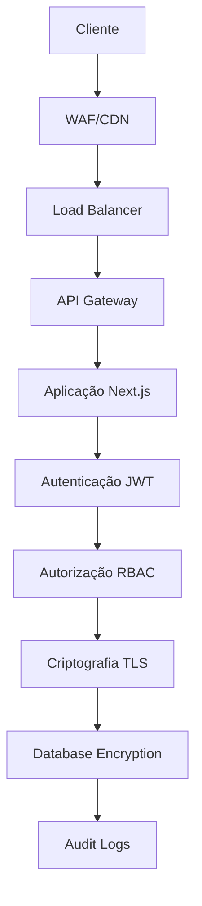

# 🔒 Guia de Segurança - CRM Pro Dashboard

## 📋 Índice

- [Visão Geral de Segurança](#visão-geral-de-segurança)
- [Autenticação e Autorização](#autenticação-e-autorização)
- [Criptografia](#criptografia)
- [Segurança de API](#segurança-de-api)
- [Proteção de Dados](#proteção-de-dados)
- [Segurança de Rede](#segurança-de-rede)
- [Monitoramento de Segurança](#monitoramento-de-segurança)
- [Backup e Recuperação](#backup-e-recuperação)
- [Conformidade LGPD](#conformidade-lgpd)
- [Auditoria](#auditoria)
- [Incidentes de Segurança](#incidentes-de-segurança)
- [Melhores Práticas](#melhores-práticas)
- [Checklist de Segurança](#checklist-de-segurança)

---

## 🛡️ Visão Geral de Segurança

O CRM Pro Dashboard implementa múltiplas camadas de segurança para proteger dados sensíveis de clientes e garantir operações seguras.

### Arquitetura de Segurança



### Princípios de Segurança

| Princípio | Descrição | Implementação |
|-----------|-----------|---------------|
| **Zero Trust** | Verificar sempre, nunca confiar | Autenticação contínua |
| **Defesa em Profundidade** | Múltiplas camadas de proteção | WAF + TLS + Criptografia |
| **Princípio do Menor Privilégio** | Acesso mínimo necessário | RBAC granular |
| **Segurança por Design** | Segurança desde o desenvolvimento | Security First Development |

---

## 🔐 Autenticação e Autorização

### Sistema de Autenticação JWT

```javascript
// Configuração JWT
const jwt = require('jsonwebtoken');
const bcrypt = require('bcryptjs');

class AuthService {
  static async generateTokens(user) {
    const payload = {
      userId: user.id,
      email: user.email,
      role: user.role,
      permissions: user.permissions
    };
    
    const accessToken = jwt.sign(payload, process.env.JWT_SECRET, {
      expiresIn: '15m',
      issuer: 'crm-dashboard',
      audience: 'crm-users'
    });
    
    const refreshToken = jwt.sign(
      { userId: user.id }, 
      process.env.JWT_REFRESH_SECRET, 
      { expiresIn: '7d' }
    );
    
    // Armazenar refresh token com hash
    await this.storeRefreshToken(user.id, refreshToken);
    
    return { accessToken, refreshToken };
  }
  
  static async verifyToken(token) {
    try {
      return jwt.verify(token, process.env.JWT_SECRET);
    } catch (error) {
      throw new Error('Token inválido');
    }
  }
  
  static async hashPassword(password) {
    const saltRounds = 12;
    return bcrypt.hash(password, saltRounds);
  }
  
  static async validatePassword(password, hash) {
    return bcrypt.compare(password, hash);
  }
}
```

### Controle de Acesso Baseado em Funções (RBAC)

```javascript
// Sistema RBAC
const permissions = {
  // Permissões básicas
  'dashboard.view': 'Visualizar dashboard',
  'contacts.view': 'Visualizar contatos',
  'contacts.create': 'Criar contatos',
  'contacts.edit': 'Editar contatos',
  'contacts.delete': 'Deletar contatos',
  
  // Permissões avançadas
  'messages.send': 'Enviar mensagens',
  'messages.broadcast': 'Enviar mensagens em massa',
  'analytics.view': 'Visualizar analytics',
  'settings.edit': 'Editar configurações',
  
  // Permissões administrativas
  'users.manage': 'Gerenciar usuários',
  'billing.manage': 'Gerenciar faturamento',
  'system.admin': 'Administração do sistema'
};

const roles = {
  'user': [
    'dashboard.view',
    'contacts.view',
    'contacts.create',
    'messages.send'
  ],
  'manager': [
    ...roles.user,
    'contacts.edit',
    'contacts.delete',
    'messages.broadcast',
    'analytics.view'
  ],
  'admin': [
    ...roles.manager,
    'settings.edit',
    'users.manage',
    'billing.manage',
    'system.admin'
  ]
};

// Middleware de autorização
function requirePermission(permission) {
  return (req, res, next) => {
    const userPermissions = roles[req.user.role] || [];
    
    if (!userPermissions.includes(permission)) {
      return res.status(403).json({
        error: 'Forbidden',
        message: 'Permissão insuficiente',
        required: permission
      });
    }
    
    next();
  };
}
```

### Autenticação Multi-Fator (2FA)

```javascript
// Implementação TOTP
const speakeasy = require('speakeasy');
const QRCode = require('qrcode');

class TwoFactorAuth {
  static async generateSecret(userEmail) {
    const secret = speakeasy.generateSecret({
      name: `CRM Dashboard (${userEmail})`,
      issuer: 'CRM Pro Dashboard',
      length: 32
    });
    
    const qrCodeUrl = await QRCode.toDataURL(secret.otpauth_url);
    
    return {
      secret: secret.base32,
      qrCode: qrCodeUrl,
      backupCodes: this.generateBackupCodes()
    };
  }
  
  static verifyToken(token, secret) {
    return speakeasy.totp.verify({
      secret: secret,
      encoding: 'base32',
      token: token,
      window: 2 // Permite 30s de tolerância
    });
  }
  
  static generateBackupCodes() {
    return Array.from({ length: 10 }, () => 
      Math.random().toString(36).substring(2, 10).toUpperCase()
    );
  }
}
```

---

## 🔐 Criptografia

### Criptografia de Dados Sensíveis

```javascript
// Criptografia AES-256
const crypto = require('crypto');

class EncryptionService {
  static encrypt(text, key = process.env.ENCRYPTION_KEY) {
    const algorithm = 'aes-256-gcm';
    const iv = crypto.randomBytes(16);
    const cipher = crypto.createCipher(algorithm, key, iv);
    
    let encrypted = cipher.update(text, 'utf8', 'hex');
    encrypted += cipher.final('hex');
    
    const authTag = cipher.getAuthTag();
    
    return {
      encrypted: encrypted,
      iv: iv.toString('hex'),
      authTag: authTag.toString('hex')
    };
  }
  
  static decrypt(encryptedData, key = process.env.ENCRYPTION_KEY) {
    const algorithm = 'aes-256-gcm';
    const iv = Buffer.from(encryptedData.iv, 'hex');
    const authTag = Buffer.from(encryptedData.authTag, 'hex');
    
    const decipher = crypto.createDecipher(algorithm, key, iv);
    decipher.setAuthTag(authTag);
    
    let decrypted = decipher.update(encryptedData.encrypted, 'hex', 'utf8');
    decrypted += decipher.final('utf8');
    
    return decrypted;
  }
  
  static hashSensitiveData(data) {
    return crypto.createHash('sha256')
      .update(data + process.env.HASH_SALT)
      .digest('hex');
  }
}
```

### Configuração TLS/SSL

```nginx
# Configuração Nginx para TLS
server {
    listen 443 ssl http2;
    server_name crmprodasboard.com;
    
    # Certificados SSL
    ssl_certificate /etc/ssl/certs/crm-dashboard.crt;
    ssl_certificate_key /etc/ssl/private/crm-dashboard.key;
    
    # Configurações SSL modernas
    ssl_protocols TLSv1.2 TLSv1.3;
    ssl_ciphers ECDHE-RSA-AES128-GCM-SHA256:ECDHE-RSA-AES256-GCM-SHA384;
    ssl_prefer_server_ciphers off;
    
    # HSTS
    add_header Strict-Transport-Security "max-age=63072000" always;
    
    # Security headers
    add_header X-Frame-Options DENY;
    add_header X-Content-Type-Options nosniff;
    add_header X-XSS-Protection "1; mode=block";
    add_header Referrer-Policy "strict-origin-when-cross-origin";
    
    # CSP
    add_header Content-Security-Policy "default-src 'self'; script-src 'self' 'unsafe-inline'; style-src 'self' 'unsafe-inline'";
}
```

---

## 🔌 Segurança de API

### Rate Limiting e Throttling

```javascript
// Rate limiting avançado
const rateLimit = require('express-rate-limit');
const slowDown = require('express-slow-down');

// Rate limiting por endpoint
const createAccountLimiter = rateLimit({
  windowMs: 15 * 60 * 1000, // 15 minutos
  max: 5, // máximo 5 tentativas
  message: {
    error: 'Too many accounts created',
    retryAfter: 15 * 60
  },
  standardHeaders: true,
  legacyHeaders: false,
});

// Slow down para tentativas de login
const loginSlowDown = slowDown({
  windowMs: 15 * 60 * 1000,
  delayAfter: 3,
  delayMs: 500,
  maxDelayMs: 20000,
});

// API key authentication
function validateApiKey(req, res, next) {
  const apiKey = req.headers['x-api-key'];
  
  if (!apiKey) {
    return res.status(401).json({ error: 'API key required' });
  }
  
  const hashedKey = crypto.createHash('sha256').update(apiKey).digest('hex');
  
  // Verificar API key no banco
  const validKey = await db.query(
    'SELECT * FROM api_keys WHERE key_hash = $1 AND active = true',
    [hashedKey]
  );
  
  if (!validKey.rows.length) {
    return res.status(401).json({ error: 'Invalid API key' });
  }
  
  req.apiKey = validKey.rows[0];
  next();
}
```

### Validação e Sanitização

```javascript
// Validação com Joi
const Joi = require('joi');

const schemas = {
  createContact: Joi.object({
    name: Joi.string().min(2).max(100).required(),
    email: Joi.string().email().optional(),
    phone: Joi.string().pattern(/^\+?[1-9]\d{1,14}$/).required(),
    tags: Joi.array().items(Joi.string().max(50)).max(10).optional()
  }),
  
  sendMessage: Joi.object({
    to: Joi.string().pattern(/^\+?[1-9]\d{1,14}$/).required(),
    message: Joi.string().max(4096).required(),
    type: Joi.string().valid('text', 'image', 'document').default('text')
  })
};

// Middleware de validação
function validateSchema(schema) {
  return (req, res, next) => {
    const { error, value } = schema.validate(req.body);
    
    if (error) {
      return res.status(400).json({
        error: 'Validation error',
        details: error.details.map(d => d.message)
      });
    }
    
    req.validatedData = value;
    next();
  };
}

// Sanitização contra XSS
const xss = require('xss');

function sanitizeInput(req, res, next) {
  if (req.body) {
    for (const key in req.body) {
      if (typeof req.body[key] === 'string') {
        req.body[key] = xss(req.body[key]);
      }
    }
  }
  next();
}
```

---

## 🗄️ Proteção de Dados

### Criptografia de Banco de Dados

```sql
-- Configuração de criptografia no PostgreSQL
-- Criar extensão de criptografia
CREATE EXTENSION IF NOT EXISTS pgcrypto;

-- Função para criptografar dados sensíveis
CREATE OR REPLACE FUNCTION encrypt_sensitive_data(data text)
RETURNS text AS $$
BEGIN
    RETURN encode(encrypt(data::bytea, 'encryption_key', 'aes'), 'base64');
END;
$$ LANGUAGE plpgsql;

-- Função para descriptografar
CREATE OR REPLACE FUNCTION decrypt_sensitive_data(encrypted_data text)
RETURNS text AS $$
BEGIN
    RETURN convert_from(decrypt(decode(encrypted_data, 'base64'), 'encryption_key', 'aes'), 'UTF8');
END;
$$ LANGUAGE plpgsql;

-- Tabela com dados criptografados
CREATE TABLE secure_contacts (
    id UUID PRIMARY KEY DEFAULT gen_random_uuid(),
    name_encrypted TEXT NOT NULL,
    phone_encrypted TEXT NOT NULL,
    email_encrypted TEXT,
    created_at TIMESTAMP DEFAULT NOW()
);

-- Trigger para criptografia automática
CREATE OR REPLACE FUNCTION encrypt_contact_data()
RETURNS TRIGGER AS $$
BEGIN
    NEW.name_encrypted = encrypt_sensitive_data(NEW.name);
    NEW.phone_encrypted = encrypt_sensitive_data(NEW.phone);
    IF NEW.email IS NOT NULL THEN
        NEW.email_encrypted = encrypt_sensitive_data(NEW.email);
    END IF;
    RETURN NEW;
END;
$$ LANGUAGE plpgsql;
```

### Anonimização de Dados

```javascript
// Sistema de anonimização
class DataAnonymizer {
  static anonymizePhone(phone) {
    const digits = phone.replace(/\D/g, '');
    const visibleDigits = 4;
    const maskedPart = '*'.repeat(Math.max(0, digits.length - visibleDigits));
    return maskedPart + digits.slice(-visibleDigits);
  }
  
  static anonymizeEmail(email) {
    const [localPart, domain] = email.split('@');
    const visibleChars = Math.min(2, localPart.length);
    const maskedLocal = localPart.substring(0, visibleChars) + 
                       '*'.repeat(Math.max(0, localPart.length - visibleChars));
    return maskedLocal + '@' + domain;
  }
  
  static anonymizeName(name) {
    const words = name.split(' ');
    return words.map((word, index) => {
      if (index === 0) return word; // Manter primeiro nome
      return word.charAt(0) + '*'.repeat(word.length - 1);
    }).join(' ');
  }
  
  static async anonymizeUserData(userId, reason) {
    await db.query(`
      UPDATE contacts 
      SET 
        name = $1,
        phone = $2,
        email = $3,
        anonymized_at = NOW(),
        anonymization_reason = $4
      WHERE user_id = $5
    `, [
      this.anonymizeName(contact.name),
      this.anonymizePhone(contact.phone),
      this.anonymizeEmail(contact.email),
      reason,
      userId
    ]);
    
    // Log da anonimização
    await this.logAnonymization(userId, reason);
  }
}
```

---

## 🌐 Segurança de Rede

### Firewall e WAF

```yaml
# Configuração de WAF (Web Application Firewall)
version: '3.8'
services:
  waf:
    image: owasp/modsecurity-crs:nginx
    ports:
      - "80:80"
      - "443:443"
    environment:
      - SERVERNAME=crmprodasboard.com
      - BACKEND=http://app:3000
      - MODSEC_RULE_ENGINE=on
      - MODSEC_REQ_BODY_ACCESS=on
      - MODSEC_REQ_BODY_LIMIT=13107200
      - MODSEC_RESP_BODY_ACCESS=on
      - MODSEC_AUDIT_ENGINE=on
    volumes:
      - ./waf/custom-rules:/etc/modsecurity.d/custom-rules:ro
```

### Configuração de Rede Segura

```bash
#!/bin/bash
# Script de configuração de segurança de rede

# Configurar iptables
iptables -A INPUT -p tcp --dport 22 -s TRUSTED_IP -j ACCEPT
iptables -A INPUT -p tcp --dport 22 -j DROP
iptables -A INPUT -p tcp --dport 80 -j ACCEPT
iptables -A INPUT -p tcp --dport 443 -j ACCEPT
iptables -A INPUT -p tcp --dport 5432 -s localhost -j ACCEPT
iptables -A INPUT -p tcp --dport 5432 -j DROP

# Configurar fail2ban
cat > /etc/fail2ban/jail.local << EOF
[DEFAULT]
bantime = 3600
findtime = 600
maxretry = 3

[nginx-http-auth]
enabled = true
port = http,https
logpath = /var/log/nginx/error.log

[nginx-dos]
enabled = true
port = http,https
filter = nginx-dos
logpath = /var/log/nginx/access.log
maxretry = 10
findtime = 60
bantime = 3600
EOF

systemctl restart fail2ban
```

---

## 📊 Monitoramento de Segurança

### Sistema de Logs de Segurança

```javascript
// Logger de segurança
const winston = require('winston');

const securityLogger = winston.createLogger({
  level: 'info',
  format: winston.format.combine(
    winston.format.timestamp(),
    winston.format.json()
  ),
  transports: [
    new winston.transports.File({ 
      filename: 'logs/security.log',
      maxsize: 5242880, // 5MB
      maxFiles: 10
    })
  ]
});

class SecurityMonitor {
  static logSecurityEvent(event, details) {
    securityLogger.info('Security Event', {
      event,
      timestamp: new Date().toISOString(),
      ...details
    });
  }
  
  static logFailedLogin(ip, email, reason) {
    this.logSecurityEvent('failed_login', {
      ip,
      email,
      reason,
      severity: 'medium'
    });
    
    // Verificar múltiplas tentativas
    this.checkBruteForce(ip, email);
  }
  
  static logSuspiciousActivity(userId, activity, metadata) {
    this.logSecurityEvent('suspicious_activity', {
      userId,
      activity,
      metadata,
      severity: 'high'
    });
    
    // Alertar administradores
    this.alertAdmins('Atividade suspeita detectada', {
      userId,
      activity,
      timestamp: new Date()
    });
  }
  
  static async checkBruteForce(ip, email) {
    const attempts = await redis.incr(`failed_login:${ip}:${email}`);
    
    if (attempts === 1) {
      await redis.expire(`failed_login:${ip}:${email}`, 900); // 15 min
    }
    
    if (attempts >= 5) {
      await this.blockIP(ip, 'Brute force attempt');
      this.alertAdmins('Possível ataque de força bruta', { ip, email });
    }
  }
}
```

### Detecção de Anomalias

```javascript
// Sistema de detecção de anomalias
class AnomalyDetector {
  static async analyzeUserBehavior(userId, action) {
    const userStats = await this.getUserStats(userId);
    const currentHour = new Date().getHours();
    
    // Verificar horário incomum
    if (!this.isNormalHour(userStats.usualHours, currentHour)) {
      SecurityMonitor.logSuspiciousActivity(userId, 'unusual_hour', {
        currentHour,
        usualHours: userStats.usualHours
      });
    }
    
    // Verificar geolocalização
    const currentLocation = await this.getLocationFromIP(req.ip);
    if (!this.isNormalLocation(userStats.usualLocations, currentLocation)) {
      SecurityMonitor.logSuspiciousActivity(userId, 'unusual_location', {
        currentLocation,
        usualLocations: userStats.usualLocations
      });
    }
    
    // Verificar frequência de ações
    const recentActions = await this.getRecentActions(userId, action);
    if (this.isUnusualFrequency(recentActions)) {
      SecurityMonitor.logSuspiciousActivity(userId, 'unusual_frequency', {
        action,
        frequency: recentActions.length
      });
    }
  }
  
  static async getUserStats(userId) {
    return await db.query(`
      SELECT 
        array_agg(DISTINCT EXTRACT(hour FROM created_at)) as usual_hours,
        array_agg(DISTINCT location) as usual_locations,
        count(*) as total_actions
      FROM user_actions 
      WHERE user_id = $1 
      AND created_at > NOW() - INTERVAL '30 days'
    `, [userId]);
  }
}
```

---

## 💾 Backup e Recuperação

### Estratégia de Backup

```bash
#!/bin/bash
# Script de backup automatizado

BACKUP_DIR="/backups"
DATE=$(date +%Y%m%d_%H%M%S)
DB_NAME="crm_dashboard"

# Backup completo do banco
pg_dump -h localhost -U postgres -d $DB_NAME > "$BACKUP_DIR/db_$DATE.sql"

# Criptografar backup
gpg --symmetric --cipher-algo AES256 "$BACKUP_DIR/db_$DATE.sql"
rm "$BACKUP_DIR/db_$DATE.sql"

# Backup de arquivos de configuração
tar -czf "$BACKUP_DIR/config_$DATE.tar.gz" \
    /etc/nginx/ \
    /etc/ssl/ \
    .env \
    docker-compose.yml

# Enviar para storage seguro (AWS S3 com criptografia)
aws s3 cp "$BACKUP_DIR/db_$DATE.sql.gpg" \
    s3://crm-backups/database/ \
    --sse AES256

aws s3 cp "$BACKUP_DIR/config_$DATE.tar.gz" \
    s3://crm-backups/config/ \
    --sse AES256

# Limpar backups locais antigos (manter 7 dias)
find $BACKUP_DIR -name "*.gpg" -mtime +7 -delete
find $BACKUP_DIR -name "*.tar.gz" -mtime +7 -delete

# Log do backup
echo "$(date): Backup completed successfully" >> /var/log/backup.log
```

### Plano de Recuperação de Desastres

```yaml
# Plano de Disaster Recovery
disaster_recovery:
  rto: 4h  # Recovery Time Objective
  rpo: 1h  # Recovery Point Objective
  
  procedures:
    data_corruption:
      - Identificar escopo da corrupção
      - Restaurar último backup válido
      - Aplicar logs de transação
      - Validar integridade dos dados
      
    security_breach:
      - Isolar sistemas comprometidos
      - Analisar logs de segurança
      - Trocar todas as credenciais
      - Restaurar de backup limpo
      - Implementar patches de segurança
      
    infrastructure_failure:
      - Ativar ambiente de backup
      - Redirecionar DNS
      - Sincronizar dados
      - Validar funcionalidades
```

---

## 📜 Conformidade LGPD

### Implementação LGPD

```javascript
// Sistema de conformidade LGPD
class LGPDCompliance {
  static async recordConsent(userId, purpose, method) {
    await db.query(`
      INSERT INTO consent_records (user_id, purpose, method, granted_at)
      VALUES ($1, $2, $3, NOW())
    `, [userId, purpose, method]);
  }
  
  static async revokeConsent(userId, purpose) {
    await db.query(`
      UPDATE consent_records 
      SET revoked_at = NOW() 
      WHERE user_id = $1 AND purpose = $2 AND revoked_at IS NULL
    `, [userId, purpose]);
  }
  
  static async exportUserData(userId) {
    const userData = await db.query(`
      SELECT 
        u.email, u.created_at,
        array_agg(c.name) as contacts,
        array_agg(m.content) as messages
      FROM users u
      LEFT JOIN contacts c ON c.user_id = u.id
      LEFT JOIN messages m ON m.contact_id = c.id
      WHERE u.id = $1
      GROUP BY u.id
    `, [userId]);
    
    return {
      personal_data: userData.rows[0],
      export_date: new Date().toISOString(),
      format: 'JSON',
      retention_policy: '5 years'
    };
  }
  
  static async deleteUserData(userId, reason) {
    // Soft delete com anonimização
    await DataAnonymizer.anonymizeUserData(userId, reason);
    
    // Marcar para exclusão definitiva após período legal
    await db.query(`
      UPDATE users 
      SET 
        deletion_requested_at = NOW(),
        deletion_reason = $2,
        status = 'pending_deletion'
      WHERE id = $1
    `, [userId, reason]);
  }
}
```

---

## 🔍 Auditoria

### Sistema de Auditoria

```javascript
// Sistema completo de auditoria
class AuditLogger {
  static async logAction(userId, action, resourceType, resourceId, details = {}) {
    await db.query(`
      INSERT INTO audit_logs (
        user_id, action, resource_type, resource_id, 
        details, ip_address, user_agent, timestamp
      ) VALUES ($1, $2, $3, $4, $5, $6, $7, NOW())
    `, [
      userId,
      action,
      resourceType,
      resourceId,
      JSON.stringify(details),
      details.ipAddress,
      details.userAgent
    ]);
  }
  
  static async generateAuditReport(startDate, endDate, filters = {}) {
    const query = `
      SELECT 
        al.*,
        u.email as user_email,
        u.role as user_role
      FROM audit_logs al
      JOIN users u ON al.user_id = u.id
      WHERE al.timestamp BETWEEN $1 AND $2
      ${filters.userId ? 'AND al.user_id = $3' : ''}
      ${filters.action ? 'AND al.action = $4' : ''}
      ORDER BY al.timestamp DESC
    `;
    
    const params = [startDate, endDate];
    if (filters.userId) params.push(filters.userId);
    if (filters.action) params.push(filters.action);
    
    const result = await db.query(query, params);
    return result.rows;
  }
}

// Middleware de auditoria
function auditMiddleware(req, res, next) {
  const originalSend = res.send;
  
  res.send = function(data) {
    // Log da ação após resposta
    if (res.statusCode < 400) {
      AuditLogger.logAction(
        req.user?.id,
        `${req.method} ${req.route?.path}`,
        'api_endpoint',
        req.route?.path,
        {
          statusCode: res.statusCode,
          ipAddress: req.ip,
          userAgent: req.get('User-Agent')
        }
      );
    }
    
    originalSend.call(this, data);
  };
  
  next();
}
```

---

## 🚨 Incidentes de Segurança

### Plano de Resposta a Incidentes

```javascript
// Sistema de resposta a incidentes
class IncidentResponse {
  static async reportIncident(type, severity, description, metadata = {}) {
    const incident = await db.query(`
      INSERT INTO security_incidents (
        type, severity, description, metadata, 
        reported_at, status
      ) VALUES ($1, $2, $3, $4, NOW(), 'open')
      RETURNING id
    `, [type, severity, description, JSON.stringify(metadata)]);
    
    const incidentId = incident.rows[0].id;
    
    // Executar resposta automática baseada na severidade
    await this.executeAutomaticResponse(type, severity, incidentId);
    
    // Notificar equipe de segurança
    await this.notifySecurityTeam(incidentId, type, severity);
    
    return incidentId;
  }
  
  static async executeAutomaticResponse(type, severity, incidentId) {
    switch (severity) {
      case 'critical':
        // Bloquear IPs suspeitos
        if (type === 'brute_force') {
          await this.blockSuspiciousIPs();
        }
        // Ativar modo de emergência
        await this.activateEmergencyMode();
        break;
        
      case 'high':
        // Aumentar nível de logging
        await this.increaseLoglevel();
        // Ativar monitoramento adicional
        await this.activateAdditionalMonitoring();
        break;
    }
  }
  
  static async containThreat(incidentId, actions) {
    for (const action of actions) {
      switch (action.type) {
        case 'block_ip':
          await this.blockIP(action.ip, 'Security incident');
          break;
        case 'disable_user':
          await this.disableUser(action.userId, 'Security incident');
          break;
        case 'rotate_keys':
          await this.rotateAPIKeys();
          break;
      }
    }
    
    await db.query(`
      UPDATE security_incidents 
      SET status = 'contained', contained_at = NOW()
      WHERE id = $1
    `, [incidentId]);
  }
}
```

---

## ✅ Melhores Práticas

### Desenvolvimento Seguro

```javascript
// Checklist de desenvolvimento seguro
const securityChecklist = {
  authentication: [
    'Implementar autenticação forte',
    'Usar tokens JWT com expiração',
    'Implementar 2FA quando necessário',
    'Hash de senhas com salt forte'
  ],
  
  authorization: [
    'Implementar RBAC',
    'Princípio do menor privilégio',
    'Validar permissões em cada endpoint',
    'Sanitizar parâmetros de entrada'
  ],
  
  dataProtection: [
    'Criptografar dados sensíveis',
    'Usar HTTPS em todas as comunicações',
    'Implementar backup criptografado',
    'Anonimizar dados quando necessário'
  ],
  
  monitoring: [
    'Logs de segurança detalhados',
    'Monitoramento de anomalias',
    'Alertas em tempo real',
    'Auditoria regular'
  ]
};
```

### Configurações de Segurança

```javascript
// Configurações de segurança do Express
const helmet = require('helmet');

app.use(helmet({
  contentSecurityPolicy: {
    directives: {
      defaultSrc: ["'self'"],
      styleSrc: ["'self'", "'unsafe-inline'"],
      scriptSrc: ["'self'"],
      imgSrc: ["'self'", "data:", "https:"],
      connectSrc: ["'self'"],
      fontSrc: ["'self'"],
      objectSrc: ["'none'"],
      mediaSrc: ["'self'"],
      frameSrc: ["'none'"],
    },
  },
  crossOriginEmbedderPolicy: false
}));

// Configurar CORS de forma segura
const cors = require('cors');
app.use(cors({
  origin: process.env.ALLOWED_ORIGINS?.split(',') || 'http://localhost:3000',
  credentials: true,
  optionsSuccessStatus: 200
}));
```

---

## 📋 Checklist de Segurança

### Checklist de Produção

- [ ] **Autenticação**
  - [ ] JWT implementado com expiração
  - [ ] 2FA configurado para admins
  - [ ] Rate limiting ativo
  - [ ] Senhas com hash seguro

- [ ] **Criptografia**
  - [ ] TLS 1.3 configurado
  - [ ] Dados sensíveis criptografados
  - [ ] Certificados SSL válidos
  - [ ] Perfect Forward Secrecy

- [ ] **Banco de Dados**
  - [ ] Conexões criptografadas
  - [ ] Backup criptografado
  - [ ] Privilégios mínimos
  - [ ] Auditoria ativa

- [ ] **Rede**
  - [ ] Firewall configurado
  - [ ] WAF ativo
  - [ ] DDoS protection
  - [ ] IPs maliciosos bloqueados

- [ ] **Monitoramento**
  - [ ] Logs de segurança ativos
  - [ ] Alertas configurados
  - [ ] SIEM implementado
  - [ ] Métricas de segurança

- [ ] **Compliance**
  - [ ] LGPD implementada
  - [ ] Políticas de retenção
  - [ ] Processo de exclusão
  - [ ] Auditoria regular

---

## 📞 Contatos de Emergência

### Equipe de Segurança

- 🚨 **Emergência**: +55 11 99999-9999
- 📧 **Email**: security@crmprodasboard.com
- 💬 **Slack**: #security-alerts
- 🎫 **Tickets**: [security.crmprodasboard.com](https://security.crmprodasboard.com)

### Procedimento de Emergência

1. **Detectar** o incidente
2. **Isolar** sistemas afetados
3. **Comunicar** à equipe de segurança
4. **Documentar** evidências
5. **Recuperar** serviços
6. **Analisar** causas raiz

---

*Última atualização: $(date +%d/%m/%Y)*

*Este documento é confidencial e deve ser tratado com o máximo cuidado.*
