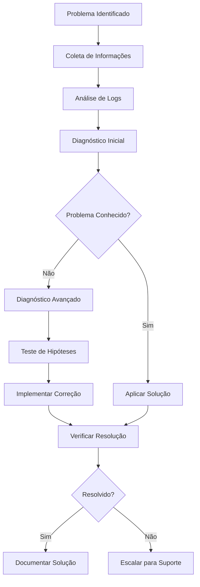

# 🔧 Guia de Troubleshooting - CRM Pro Dashboard

## 📋 Índice

- [Visão Geral](#visão-geral)
- [Diagnóstico Rápido](#diagnóstico-rápido)
- [Problemas de Conexão](#problemas-de-conexão)
- [Problemas de Performance](#problemas-de-performance)
- [Problemas de Autenticação](#problemas-de-autenticação)
- [Problemas do WhatsApp](#problemas-do-whatsapp)
- [Problemas de Base de Dados](#problemas-de-base-de-dados)
- [Problemas de Deploy](#problemas-de-deploy)
- [Problemas de Integração](#problemas-de-integração)
- [Logs e Monitoramento](#logs-e-monitoramento)
- [Ferramentas de Diagnóstico](#ferramentas-de-diagnóstico)
- [Scripts de Recuperação](#scripts-de-recuperação)
- [FAQ](#faq)
- [Contato para Suporte](#contato-para-suporte)

---

## 🎯 Visão Geral

Este guia fornece soluções para os problemas mais comuns encontrados no CRM Pro Dashboard, com procedimentos passo-a-passo para diagnóstico e resolução.

### Metodologia de Troubleshooting



---

## ⚡ Diagnóstico Rápido

### Script de Health Check

```bash
#!/bin/bash
# quick-diagnosis.sh

echo "🔍 Executando diagnóstico rápido..."

# Verificar status dos serviços
echo "=== STATUS DOS SERVIÇOS ==="
systemctl status crm-dashboard || echo "Serviço não está configurado no systemd"
docker-compose ps 2>/dev/null || echo "Docker Compose não encontrado"

# Verificar conectividade
echo "=== CONECTIVIDADE ==="
curl -s http://localhost:3000/api/health && echo " ✅ API OK" || echo " ❌ API Falhou"
curl -s http://localhost:3000 && echo " ✅ Frontend OK" || echo " ❌ Frontend Falhou"

# Verificar recursos do sistema
echo "=== RECURSOS DO SISTEMA ==="
echo "CPU: $(top -bn1 | grep "Cpu(s)" | awk '{print $2}' | cut -d'%' -f1)% usado"
echo "Memória: $(free | grep Mem | awk '{printf("%.1f%%", $3/$2 * 100.0)}')"
echo "Disco: $(df -h / | awk 'NR==2 {print $5}')"

# Verificar logs recentes
echo "=== ERROS RECENTES ==="
tail -n 5 /var/log/nginx/error.log 2>/dev/null || echo "Logs do Nginx não encontrados"
docker-compose logs --tail=5 app 2>/dev/null || echo "Logs do Docker não encontrados"

echo "✅ Diagnóstico concluído!"
```

### Checklist de Problemas Comuns

- [ ] **Serviços rodando?** `docker-compose ps` ou `systemctl status`
- [ ] **Portas abertas?** `netstat -tulpn | grep :3000`
- [ ] **Conectividade de rede?** `curl localhost:3000/api/health`
- [ ] **Espaço em disco?** `df -h`
- [ ] **Memória disponível?** `free -h`
- [ ] **Logs de erro?** `tail /var/log/nginx/error.log`
- [ ] **Variáveis de ambiente?** `env | grep DATABASE_URL`

---

## 🌐 Problemas de Conexão

### Erro: "Cannot connect to server"

**Sintomas:**
- Página não carrega
- Timeout de conexão
- Erro 502/503

**Diagnóstico:**
```bash
# Verificar se a aplicação está rodando
curl -I http://localhost:3000
netstat -tulpn | grep :3000

# Verificar logs
docker-compose logs app
tail -f /var/log/nginx/error.log
```

**Soluções:**

#### 1. Restart da Aplicação
```bash
# Docker
docker-compose restart app

# Systemd
sudo systemctl restart crm-dashboard

# PM2
pm2 restart crm-dashboard
```

#### 2. Verificar Configuração do Nginx
```bash
# Testar configuração
sudo nginx -t

# Restart do Nginx
sudo systemctl restart nginx

# Verificar logs
tail -f /var/log/nginx/error.log
```

#### 3. Verificar Firewall
```bash
# Status do UFW
sudo ufw status

# Abrir portas necessárias
sudo ufw allow 80/tcp
sudo ufw allow 443/tcp
sudo ufw allow 3000/tcp
```

### Erro: "SSL Certificate Error"

**Sintomas:**
- Aviso de certificado inválido
- Erro "NET::ERR_CERT_INVALID"

**Soluções:**

#### 1. Renovar Certificado Let's Encrypt
```bash
# Verificar status do certificado
sudo certbot certificates

# Renovar certificado
sudo certbot renew --force-renewal

# Restart do Nginx
sudo systemctl restart nginx
```

#### 2. Verificar Configuração SSL
```bash
# Testar SSL
openssl s_client -connect seu-dominio.com:443

# Verificar datas do certificado
echo | openssl s_client -connect seu-dominio.com:443 2>/dev/null | openssl x509 -dates -noout
```

---

## 🚀 Problemas de Performance

### Aplicação Lenta

**Sintomas:**
- Carregamento lento de páginas
- Timeouts de API
- Alto uso de CPU/Memória

**Diagnóstico:**
```bash
# Monitorar recursos
htop
iostat -x 1
docker stats

# Verificar queries lentas
docker-compose exec postgres psql -U postgres -d crm_dashboard -c "
  SELECT query, mean_exec_time, calls 
  FROM pg_stat_statements 
  ORDER BY mean_exec_time DESC 
  LIMIT 10;
"

# Analisar logs de performance
grep "slow" /var/log/nginx/access.log
```

**Soluções:**

#### 1. Otimização de Database
```sql
-- Verificar índices ausentes
SELECT schemaname, tablename, attname, n_distinct, correlation 
FROM pg_stats 
WHERE tablename = 'messages' OR tablename = 'contacts';

-- Criar índices necessários
CREATE INDEX CONCURRENTLY idx_messages_created_at ON messages(created_at);
CREATE INDEX CONCURRENTLY idx_contacts_user_id ON contacts(user_id);

-- Atualizar estatísticas
ANALYZE;

-- Vacuum para limpeza
VACUUM ANALYZE;
```

#### 2. Configuração de Cache
```bash
# Verificar status do Redis
docker-compose exec redis redis-cli ping

# Verificar cache do Nginx
curl -I http://localhost/api/contacts
# Procurar header: X-Cache-Status

# Limpar cache se necessário
docker-compose exec redis redis-cli FLUSHALL
sudo rm -rf /var/cache/nginx/*
```

#### 3. Ajuste de Recursos
```yaml
# docker-compose.yml - Ajustar limites
services:
  app:
    deploy:
      resources:
        limits:
          memory: 2G
          cpus: '2.0'
        reservations:
          memory: 1G
          cpus: '1.0'
```

### Alto Uso de Memória

**Diagnóstico:**
```bash
# Verificar uso por processo
ps aux --sort=-%mem | head

# Verificar memory leaks no Node.js
docker-compose exec app node --inspect=0.0.0.0:9229 server.js

# Gerar heap snapshot
docker-compose exec app kill -USR2 $(pgrep node)
```

**Soluções:**

#### 1. Configurar Limites do Node.js
```bash
# Configurar no .env
NODE_OPTIONS="--max-old-space-size=2048"
```

#### 2. Restart Programado
```bash
# Crontab para restart diário
0 3 * * * cd /opt/crm-dashboard && docker-compose restart app
```

---

## 🔐 Problemas de Autenticação

### Erro: "JWT Token Invalid"

**Sintomas:**
- Usuários sendo deslogados constantemente
- Erro 401 Unauthorized
- "Token has expired"

**Diagnóstico:**
```bash
# Verificar configuração JWT
echo $JWT_SECRET
node -e "console.log(require('jsonwebtoken').verify('seu-token', process.env.JWT_SECRET))"

# Verificar logs de auth
grep "unauthorized" logs/app.log
grep "token" logs/app.log
```

**Soluções:**

#### 1. Verificar Configuração JWT
```javascript
// Verificar se JWT_SECRET está configurado
if (!process.env.JWT_SECRET) {
  console.error('JWT_SECRET not configured!');
  process.exit(1);
}

// Verificar expiração de tokens
const tokenExpiry = 15 * 60; // 15 minutos
const refreshTokenExpiry = 7 * 24 * 60 * 60; // 7 dias
```

#### 2. Regenerar Secret
```bash
# Gerar novo JWT secret
openssl rand -base64 64

# Atualizar .env
JWT_SECRET=novo-secret-aqui

# Restart da aplicação
docker-compose restart app
```

### Erro: "Database Connection Failed"

**Sintomas:**
- Erro ao fazer login
- "Connection terminated unexpectedly"
- Timeout de conexão

**Diagnóstico:**
```bash
# Testar conexão direta
docker-compose exec postgres psql -U postgres -d crm_dashboard -c "SELECT 1;"

# Verificar logs do PostgreSQL
docker-compose logs postgres

# Verificar variáveis de ambiente
echo $DATABASE_URL
```

**Soluções:**

#### 1. Verificar Configuração do Banco
```bash
# Verificar se o banco existe
docker-compose exec postgres psql -U postgres -c "\l"

# Criar banco se necessário
docker-compose exec postgres createdb -U postgres crm_dashboard

# Executar migrações
npm run db:migrate
```

#### 2. Restart do PostgreSQL
```bash
docker-compose restart postgres

# Aguardar inicialização
sleep 10

# Verificar status
docker-compose exec postgres pg_isready -U postgres
```

---

## 📱 Problemas do WhatsApp

### WhatsApp Não Conecta

**Sintomas:**
- QR Code não aparece
- "WhatsApp client not ready"
- Estado "DISCONNECTED"

**Diagnóstico:**
```bash
# Verificar logs do WhatsApp
docker-compose logs whatsapp-service
grep "whatsapp" logs/app.log

# Verificar arquivos de sessão
ls -la .wwebjs_auth/

# Testar conexão manual
curl http://localhost:3000/api/whatsapp/status
```

**Soluções:**

#### 1. Limpar Sessão do WhatsApp
```bash
# Parar serviço
docker-compose stop whatsapp-service

# Limpar dados de sessão
rm -rf .wwebjs_auth/
rm -rf .wwebjs_cache/

# Restart do serviço
docker-compose start whatsapp-service

# Verificar logs
docker-compose logs -f whatsapp-service
```

#### 2. Verificar Configuração
```javascript
// whatsapp-config.js
const client = new Client({
  authStrategy: new LocalAuth({
    clientId: "client-one",
    dataPath: "./.wwebjs_auth"
  }),
  puppeteer: {
    headless: true,
    args: [
      '--no-sandbox',
      '--disable-setuid-sandbox',
      '--disable-dev-shm-usage',
      '--disable-accelerated-2d-canvas',
      '--no-first-run',
      '--no-zygote',
      '--single-process',
      '--disable-gpu'
    ]
  }
});
```

#### 3. Restart com Debug
```bash
# Habilitar debug
export DEBUG=puppeteer:*
export DEBUG=whatsapp-web.js:*

# Restart com logs detalhados
docker-compose restart whatsapp-service
```

### Mensagens Não Enviadas

**Sintomas:**
- Status "pending" permanece
- Erro "Message not sent"
- Fila de mensagens crescendo

**Diagnóstico:**
```bash
# Verificar fila de mensagens
docker-compose exec redis redis-cli LLEN message_queue

# Verificar logs de envio
grep "message_send" logs/app.log
grep "error" logs/whatsapp.log

# Verificar status da conexão
curl http://localhost:3000/api/whatsapp/status
```

**Soluções:**

#### 1. Limpar Fila de Mensagens
```bash
# Limpar fila
docker-compose exec redis redis-cli DEL message_queue

# Reprocessar mensagens
curl -X POST http://localhost:3000/api/whatsapp/requeue
```

#### 2. Verificar Rate Limiting
```javascript
// Ajustar rate limiting
const RATE_LIMIT = {
  messages_per_minute: 20,
  messages_per_hour: 1000,
  delay_between_messages: 3000 // 3 segundos
};
```

---

## 🗄️ Problemas de Base de Dados

### Erro: "Connection Pool Exhausted"

**Sintomas:**
- "remaining connection slots are reserved"
- Timeouts de conexão
- Aplicação trava

**Diagnóstico:**
```sql
-- Verificar conexões ativas
SELECT count(*) FROM pg_stat_activity;

-- Verificar conexões por estado
SELECT state, count(*) FROM pg_stat_activity GROUP BY state;

-- Verificar queries longas
SELECT pid, now() - pg_stat_activity.query_start AS duration, query 
FROM pg_stat_activity 
WHERE (now() - pg_stat_activity.query_start) > interval '5 minutes';
```

**Soluções:**

#### 1. Ajustar Pool de Conexões
```javascript
// config/database.js
const pool = new Pool({
  max: 20,                    // máximo de conexões
  idleTimeoutMillis: 30000,   // timeout para conexões ociosas
  connectionTimeoutMillis: 2000, // timeout para novas conexões
  maxUses: 7500,              // máximo de usos por conexão
});
```

#### 2. Terminar Conexões Órfãs
```sql
-- Terminar conexões idle há mais de 1 hora
SELECT pg_terminate_backend(pid) 
FROM pg_stat_activity 
WHERE state = 'idle' 
AND state_change < now() - interval '1 hour';
```

#### 3. Restart do PostgreSQL
```bash
# Restart suave
docker-compose restart postgres

# Verificar se voltou
docker-compose exec postgres pg_isready -U postgres
```

### Queries Lentas

**Diagnóstico:**
```sql
-- Habilitar log de queries lentas
ALTER SYSTEM SET log_min_duration_statement = 1000; -- 1 segundo
SELECT pg_reload_conf();

-- Verificar queries mais lentas
SELECT query, mean_exec_time, calls, total_exec_time
FROM pg_stat_statements 
ORDER BY mean_exec_time DESC 
LIMIT 10;
```

**Soluções:**

#### 1. Otimizar Queries
```sql
-- Analisar plano de execução
EXPLAIN ANALYZE SELECT * FROM messages WHERE contact_id = '123';

-- Criar índices necessários
CREATE INDEX CONCURRENTLY idx_messages_contact_id ON messages(contact_id);
CREATE INDEX CONCURRENTLY idx_messages_created_at ON messages(created_at);
```

#### 2. Configurar Vacuum Automático
```sql
-- Verificar configuração de autovacuum
SHOW autovacuum;

-- Ajustar parâmetros se necessário
ALTER SYSTEM SET autovacuum_vacuum_scale_factor = 0.1;
ALTER SYSTEM SET autovacuum_analyze_scale_factor = 0.05;
SELECT pg_reload_conf();
```

---

## 🚀 Problemas de Deploy

### Erro: "Build Failed"

**Sintomas:**
- CI/CD pipeline falha
- Erro durante `npm run build`
- "Module not found"

**Diagnóstico:**
```bash
# Verificar logs do build
docker-compose logs --tail=50 app

# Testar build local
npm install
npm run build

# Verificar versões
node --version
npm --version
```

**Soluções:**

#### 1. Limpar Cache e Reinstalar
```bash
# Limpar cache do npm
npm cache clean --force

# Remover node_modules
rm -rf node_modules package-lock.json

# Reinstalar
npm install

# Testar build
npm run build
```

#### 2. Verificar Dependências
```bash
# Auditar dependências
npm audit
npm audit fix

# Verificar compatibilidade
npm ls --depth=0
```

### Erro: "Environment Variables Missing"

**Sintomas:**
- "DATABASE_URL is not defined"
- "JWT_SECRET is required"
- Aplicação não inicia

**Diagnóstico:**
```bash
# Verificar variáveis disponíveis
env | grep DATABASE
env | grep JWT

# Verificar arquivo .env
cat .env.production
```

**Soluções:**

#### 1. Configurar Variáveis de Ambiente
```bash
# Criar .env se não existir
cp .env.example .env.production

# Editar variáveis necessárias
nano .env.production

# Exportar para sessão atual
export $(cat .env.production | xargs)
```

#### 2. Verificar Docker Compose
```yaml
# docker-compose.yml
environment:
  - NODE_ENV=production
  - DATABASE_URL=${DATABASE_URL}
  - JWT_SECRET=${JWT_SECRET}
  - REDIS_URL=${REDIS_URL}
```

---

## 🔗 Problemas de Integração

### API Externa Não Responde

**Sintomas:**
- Timeout em integrações
- "Network error"
- "Service unavailable"

**Diagnóstico:**
```bash
# Testar conectividade
curl -I https://api.externa.com
ping api.externa.com

# Verificar DNS
nslookup api.externa.com

# Verificar logs
grep "api.externa" logs/app.log
```

**Soluções:**

#### 1. Implementar Retry Logic
```javascript
// utils/retry.js
const retry = async (fn, retries = 3, delay = 1000) => {
  for (let i = 0; i < retries; i++) {
    try {
      return await fn();
    } catch (error) {
      if (i === retries - 1) throw error;
      await new Promise(resolve => setTimeout(resolve, delay * Math.pow(2, i)));
    }
  }
};
```

#### 2. Configurar Circuit Breaker
```javascript
// utils/circuit-breaker.js
class CircuitBreaker {
  constructor(threshold = 5, timeout = 60000, monitor = false) {
    this.failureThreshold = threshold;
    this.timeout = timeout;
    this.monitor = monitor;
    this.reset();
  }
  
  async execute(fn) {
    if (this.state === 'OPEN') {
      if (Date.now() > this.nextAttempt) {
        this.state = 'HALF_OPEN';
      } else {
        throw new Error('Circuit breaker is OPEN');
      }
    }
    
    try {
      const result = await fn();
      this.success();
      return result;
    } catch (error) {
      this.failure();
      throw error;
    }
  }
}
```

### Webhook Não Funciona

**Sintomas:**
- Eventos não são recebidos
- "Webhook delivery failed"
- Status 404/500 em webhooks

**Diagnóstico:**
```bash
# Testar endpoint do webhook
curl -X POST http://localhost:3000/webhooks/test \
  -H "Content-Type: application/json" \
  -d '{"test": true}'

# Verificar logs de webhook
grep "webhook" logs/app.log

# Verificar conectividade externa
curl -X POST https://webhook.site/your-url \
  -H "Content-Type: application/json" \
  -d '{"test": true}'
```

**Soluções:**

#### 1. Verificar Configuração do Endpoint
```javascript
// routes/webhooks.js
app.post('/webhooks/:provider', async (req, res) => {
  try {
    const { provider } = req.params;
    const signature = req.headers['x-hub-signature'];
    
    // Verificar assinatura
    if (!verifySignature(req.body, signature)) {
      return res.status(401).send('Invalid signature');
    }
    
    // Processar webhook
    await processWebhook(provider, req.body);
    
    res.status(200).send('OK');
  } catch (error) {
    console.error('Webhook error:', error);
    res.status(500).send('Internal Server Error');
  }
});
```

#### 2. Configurar Tunnel para Desenvolvimento
```bash
# Instalar ngrok
npm install -g ngrok

# Criar tunnel
ngrok http 3000

# Usar URL do ngrok para webhooks
https://abc123.ngrok.io/webhooks/provider
```

---

## 📊 Logs e Monitoramento

### Configuração de Logs Estruturados

```javascript
// config/logger.js
const winston = require('winston');

const logger = winston.createLogger({
  level: process.env.LOG_LEVEL || 'info',
  format: winston.format.combine(
    winston.format.timestamp(),
    winston.format.errors({ stack: true }),
    winston.format.json()
  ),
  transports: [
    new winston.transports.File({ 
      filename: 'logs/error.log', 
      level: 'error',
      maxsize: 5242880, // 5MB
      maxFiles: 5
    }),
    new winston.transports.File({ 
      filename: 'logs/combined.log',
      maxsize: 5242880,
      maxFiles: 10
    })
  ]
});

if (process.env.NODE_ENV !== 'production') {
  logger.add(new winston.transports.Console({
    format: winston.format.simple()
  }));
}

module.exports = logger;
```

### Análise de Logs

```bash
#!/bin/bash
# analyze-logs.sh

echo "📊 Analisando logs..."

# Erros mais comuns
echo "=== ERROS MAIS COMUNS ==="
grep "ERROR" logs/combined.log | awk '{print $4}' | sort | uniq -c | sort -nr | head -10

# Endpoints mais acessados
echo "=== ENDPOINTS MAIS ACESSADOS ==="
grep "GET\|POST\|PUT\|DELETE" /var/log/nginx/access.log | awk '{print $7}' | sort | uniq -c | sort -nr | head -10

# IPs com mais requests
echo "=== IPs COM MAIS REQUESTS ==="
awk '{print $1}' /var/log/nginx/access.log | sort | uniq -c | sort -nr | head -10

# Status codes
echo "=== STATUS CODES ==="
awk '{print $9}' /var/log/nginx/access.log | sort | uniq -c | sort -nr

# Alertas críticos
echo "=== ALERTAS CRÍTICOS ==="
grep -i "critical\|fatal\|emergency" logs/combined.log
```

---

## 🛠️ Ferramentas de Diagnóstico

### Script de Diagnóstico Completo

```bash
#!/bin/bash
# full-diagnostic.sh

timestamp=$(date '+%Y%m%d_%H%M%S')
report_file="diagnostic_report_$timestamp.txt"

echo "🔍 Executando diagnóstico completo..."
echo "Relatório será salvo em: $report_file"

{
  echo "=== DIAGNÓSTICO CRM DASHBOARD ==="
  echo "Data: $(date)"
  echo "Hostname: $(hostname)"
  echo "Usuário: $(whoami)"
  echo ""

  echo "=== INFORMAÇÕES DO SISTEMA ==="
  uname -a
  echo "Uptime: $(uptime)"
  echo ""

  echo "=== RECURSOS ==="
  echo "--- CPU ---"
  lscpu | grep -E '^Thread|^Core|^Socket|^CPU\('
  echo "--- MEMÓRIA ---"
  free -h
  echo "--- DISCO ---"
  df -h
  echo ""

  echo "=== REDE ==="
  ip addr show
  echo "--- PORTAS ABERTAS ---"
  netstat -tulpn | grep LISTEN
  echo ""

  echo "=== DOCKER ==="
  docker --version
  docker-compose --version
  echo "--- CONTAINERS ---"
  docker ps -a
  echo "--- IMAGES ---"
  docker images
  echo "--- VOLUMES ---"
  docker volume ls
  echo ""

  echo "=== SERVIÇOS ==="
  systemctl list-units --type=service --state=running | grep -E 'nginx|postgres|redis'
  echo ""

  echo "=== LOGS RECENTES ==="
  echo "--- NGINX ERROR ---"
  tail -n 20 /var/log/nginx/error.log 2>/dev/null || echo "Não encontrado"
  echo "--- APPLICATION ---"
  docker-compose logs --tail=20 app 2>/dev/null || echo "Não encontrado"
  echo ""

  echo "=== CONECTIVIDADE ==="
  echo "--- HEALTH CHECKS ---"
  curl -s http://localhost:3000/api/health || echo "Health check falhou"
  echo ""
  curl -s http://localhost:3000 >/dev/null && echo "Frontend OK" || echo "Frontend falhou"
  echo ""

  echo "=== CONFIGURAÇÃO ==="
  echo "--- VARIÁVEIS DE AMBIENTE ---"
  env | grep -E '^NODE_|^DATABASE_|^REDIS_|^JWT_' | sed 's/=.*/=***/'
  echo ""

  echo "=== FIM DO RELATÓRIO ==="
} > "$report_file"

echo "✅ Diagnóstico concluído! Relatório: $report_file"

# Comprimir e enviar se necessário
if command -v gzip &> /dev/null; then
  gzip "$report_file"
  echo "📦 Relatório comprimido: ${report_file}.gz"
fi
```

### Monitoramento em Tempo Real

```bash
#!/bin/bash
# real-time-monitor.sh

echo "📊 Monitoramento em tempo real - Pressione Ctrl+C para sair"

while true; do
  clear
  echo "=== CRM DASHBOARD MONITOR ==="
  echo "Timestamp: $(date)"
  echo ""
  
  echo "🖥️  SISTEMA:"
  echo "  CPU: $(top -bn1 | grep "Cpu(s)" | awk '{print $2}' | cut -d'%' -f1)%"
  echo "  RAM: $(free | grep Mem | awk '{printf("%.1f%%", $3/$2 * 100.0)}')"
  echo "  DISK: $(df -h / | awk 'NR==2 {print $5}')"
  echo ""
  
  echo "🐳 DOCKER:"
  docker stats --no-stream --format "  {{.Name}}: CPU {{.CPUPerc}}, MEM {{.MemUsage}}"
  echo ""
  
  echo "🌐 CONECTIVIDADE:"
  if curl -s http://localhost:3000/api/health >/dev/null; then
    echo "  ✅ API Health OK"
  else
    echo "  ❌ API Health FAIL"
  fi
  
  if curl -s http://localhost:3000 >/dev/null; then
    echo "  ✅ Frontend OK"
  else
    echo "  ❌ Frontend FAIL"
  fi
  echo ""
  
  echo "📈 MÉTRICAS (últimos 30s):"
  requests=$(tail -n 1000 /var/log/nginx/access.log 2>/dev/null | grep "$(date -d '30 seconds ago' '+%d/%b/%Y:%H:%M')" | wc -l)
  echo "  Requests: $requests"
  
  errors=$(tail -n 100 /var/log/nginx/error.log 2>/dev/null | grep "$(date '+%Y/%m/%d %H:%M')" | wc -l)
  echo "  Errors: $errors"
  
  sleep 5
done
```

---

## 🔄 Scripts de Recuperação

### Auto-Recovery Script

```bash
#!/bin/bash
# auto-recovery.sh

LOG_FILE="/var/log/auto-recovery.log"

log() {
  echo "$(date '+%Y-%m-%d %H:%M:%S') - $1" | tee -a "$LOG_FILE"
}

check_service() {
  local service_name=$1
  local check_command=$2
  
  if eval "$check_command"; then
    log "✅ $service_name OK"
    return 0
  else
    log "❌ $service_name FAILED"
    return 1
  fi
}

restart_service() {
  local service_name=$1
  local restart_command=$2
  
  log "🔄 Restarting $service_name..."
  
  if eval "$restart_command"; then
    log "✅ $service_name restarted successfully"
    sleep 10
    return 0
  else
    log "❌ Failed to restart $service_name"
    return 1
  fi
}

log "🚀 Auto-recovery script started"

# Verificar aplicação
if ! check_service "Application" "curl -s http://localhost:3000/api/health"; then
  if restart_service "Application" "docker-compose restart app"; then
    if ! check_service "Application" "curl -s http://localhost:3000/api/health"; then
      log "🆘 CRITICAL: Application failed to recover"
      # Enviar alerta
      curl -X POST "$WEBHOOK_ALERT_URL" -d "Application failed to recover" || true
    fi
  fi
fi

# Verificar Nginx
if ! check_service "Nginx" "curl -s http://localhost"; then
  if restart_service "Nginx" "sudo systemctl restart nginx"; then
    if ! check_service "Nginx" "curl -s http://localhost"; then
      log "🆘 CRITICAL: Nginx failed to recover"
    fi
  fi
fi

# Verificar PostgreSQL
if ! check_service "PostgreSQL" "docker-compose exec -T postgres pg_isready -U postgres"; then
  if restart_service "PostgreSQL" "docker-compose restart postgres"; then
    sleep 30  # Aguardar mais tempo para PostgreSQL
    if ! check_service "PostgreSQL" "docker-compose exec -T postgres pg_isready -U postgres"; then
      log "🆘 CRITICAL: PostgreSQL failed to recover"
    fi
  fi
fi

# Verificar Redis
if ! check_service "Redis" "docker-compose exec -T redis redis-cli ping"; then
  if restart_service "Redis" "docker-compose restart redis"; then
    if ! check_service "Redis" "docker-compose exec -T redis redis-cli ping"; then
      log "🆘 CRITICAL: Redis failed to recover"
    fi
  fi
fi

log "✅ Auto-recovery script completed"
```

### Backup de Emergência

```bash
#!/bin/bash
# emergency-backup.sh

BACKUP_DIR="/tmp/emergency-backup-$(date +%Y%m%d_%H%M%S)"
mkdir -p "$BACKUP_DIR"

echo "🚨 Criando backup de emergência..."

# Backup do banco de dados
echo "📊 Backup do banco..."
docker-compose exec -T postgres pg_dump -U postgres -d crm_dashboard > "$BACKUP_DIR/database.sql"

# Backup de arquivos de configuração
echo "⚙️ Backup de configurações..."
cp .env.production "$BACKUP_DIR/"
cp docker-compose.production.yml "$BACKUP_DIR/"
cp -r nginx/ "$BACKUP_DIR/" 2>/dev/null || true

# Backup de uploads
echo "📁 Backup de uploads..."
tar -czf "$BACKUP_DIR/uploads.tar.gz" uploads/ 2>/dev/null || true

# Backup de logs importantes
echo "📝 Backup de logs..."
cp logs/app.log "$BACKUP_DIR/" 2>/dev/null || true
cp /var/log/nginx/error.log "$BACKUP_DIR/nginx-error.log" 2>/dev/null || true

# Comprimir tudo
echo "📦 Comprimindo backup..."
tar -czf "emergency-backup-$(date +%Y%m%d_%H%M%S).tar.gz" -C /tmp "$(basename $BACKUP_DIR)"

echo "✅ Backup de emergência criado: emergency-backup-$(date +%Y%m%d_%H%M%S).tar.gz"
```

---

## ❓ FAQ

### Perguntas Frequentes

**Q: Por que a aplicação não inicia após o deploy?**
A: Verifique:
1. Variáveis de ambiente configuradas
2. Banco de dados acessível
3. Portas não estão em uso
4. Logs de erro no Docker/systemd

**Q: Como verificar se todos os serviços estão funcionando?**
A: Execute o health check:
```bash
curl http://localhost:3000/api/health
docker-compose ps
systemctl status nginx
```

**Q: O que fazer quando o banco de dados está lento?**
A: 
1. Verificar queries lentas com `pg_stat_statements`
2. Criar índices necessários
3. Executar `VACUUM ANALYZE`
4. Verificar conexões em excesso

**Q: Como resetar completamente a aplicação?**
A:
```bash
docker-compose down -v
docker system prune -f
rm -rf .wwebjs_auth/
docker-compose up -d
```

**Q: Onde encontrar os logs de erro?**
A:
- Aplicação: `docker-compose logs app`
- Nginx: `/var/log/nginx/error.log`
- PostgreSQL: `docker-compose logs postgres`
- Sistema: `journalctl -u crm-dashboard`

**Q: Como configurar alertas automáticos?**
A: Configure webhooks ou integre com ferramentas como:
- Prometheus + Alertmanager
- Grafana Alerts  
- Slack/Discord webhooks
- Email notifications

---

## 📞 Contato para Suporte

### Níveis de Suporte

#### 🔴 **Emergência (P0)**
- Sistema completamente inoperante
- Perda de dados
- Violação de segurança

**Contatos:**
- 📞 Telefone: +55 11 99999-9999 (24/7)
- 📧 Email: emergency@crmprodasboard.com
- 💬 Slack: #emergency-support

#### 🟠 **Crítico (P1)**
- Funcionalidades principais afetadas
- Performance degradada significativamente
- Integrações falhando

**Contatos:**
- 📧 Email: support@crmprodasboard.com
- 💬 Slack: #critical-support
- 🎫 Ticket: [support.crmprodasboard.com](https://support.crmprodasboard.com)

#### 🟡 **Normal (P2)**
- Problemas gerais
- Dúvidas de configuração
- Melhorias

**Contatos:**
- 📧 Email: help@crmprodasboard.com
- 🎫 Ticket: [support.crmprodasboard.com](https://support.crmprodasboard.com)
- 📚 Documentação: [docs.crmprodasboard.com](https://docs.crmprodasboard.com)

### Informações para Suporte

Ao entrar em contato, forneça:

1. **Descrição do problema**
2. **Passos para reproduzir**
3. **Logs relevantes**
4. **Ambiente (produção/staging)**
5. **Horário do incidente**
6. **Impacto no negócio**

### Self-Service

- 📚 **Base de Conhecimento**: [kb.crmprodasboard.com](https://kb.crmprodasboard.com)
- 🎥 **Tutoriais**: [tutorials.crmprodasboard.com](https://tutorials.crmprodasboard.com)
- 💬 **Comunidade**: [community.crmprodasboard.com](https://community.crmprodasboard.com)
- 📊 **Status Page**: [status.crmprodasboard.com](https://status.crmprodasboard.com)

---

*Última atualização: $(date +%d/%m/%Y)*

*Este documento é atualizado continuamente com base no feedback dos usuários e novos problemas identificados.*
